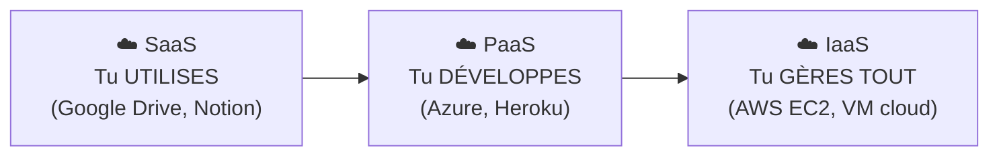

# Cloud — SaaS PaaS IaaS

> **Analogie Restaurant :** **SaaS** (Software as a Service — logiciel en tant que service) = commander un plat au restaurant : tu manges, c'est tout, la cuisine ne te concerne pas. **PaaS** (Platform as a Service — plateforme en tant que service) = cuisiner dans une cuisine équipée en location : tu amènes tes ingrédients et ta recette, mais le four et les plans de travail sont fournis. **IaaS** (Infrastructure as a Service — infrastructure en tant que service) = louer un local vide : tu amènes tout, de la plaque de cuisson aux assiettes. Plus tu descends, plus tu gères.

---

## En une phrase simple
Le cloud, c'est utiliser des **serveurs distants** au lieu de tout avoir en local. Il existe 3 niveaux de service selon ce que le fournisseur gère pour toi.

## Pourquoi ça existe ?
Pour ne pas avoir à acheter, installer, maintenir et sécuriser ses propres serveurs. Mais "cloud" ne veut pas dire "magique" — c'est un **choix technique, économique et légal**.

---

## Les 3 niveaux

| Niveau | Tu gères | Le fournisseur gère | Exemple |
|--------|----------|--------------------|----|
| **SaaS** | Rien (juste l'usage) | Tout | Google Drive, Notion, Office 365 |
| **PaaS** | Ton application | Serveur, OS, plateforme | Azure App Services, Heroku |
| **IaaS** | Serveur, OS, app, config | Juste le matériel physique | AWS EC2, Azure VM |

---

## Responsabilité partagée

| Aspect | Local | Cloud |
|--------|-------|-------|
| Contrôle des données | Toi | Toi + fournisseur |
| Disponibilité | Toi (électricité, réseau) | Fournisseur (mais dépend d'internet) |
| Sécurité | Toi | Partagée (modèle de responsabilité) |

> Si ce n'est pas chez vous, ce n'est pas totalement à vous.

---

## Risques du cloud
- Perte d'accès (mot de passe, compte bloqué)
- Dépendance internet (si internet coupe = plus de travail)
- Fuite de données
- Erreur humaine (suppression synchronisée)
- Fournisseur compromis
- Changement de conditions d'utilisation

---

## Cloud et sauvegardes

Le cloud peut faire PARTIE d'une stratégie 3-2-1, mais **pas être la seule copie**.

| | Cloud seul | Cloud + sauvegarde locale |
|-|-----------|--------------------------|
| Suppression accidentelle | Perdu (synchro) | Récupérable |
| Ransomware | Synchronisé | Copie isolée intacte |
| Fournisseur down | Inaccessible | Copie locale disponible |

---

## Connexions
- [[Sauvegardes — Types & stratégies]] — le cloud est UN des emplacements possibles
- [[Règle 3-2-1]] — le cloud = la copie "hors site", pas la seule copie
- [[Synchronisation vs Sauvegarde]] — OneDrive = synchro, pas sauvegarde
- [[Cyber-résilience]] — cloud sans stratégie = fausse sécurité

---

## Questions de rappel actif

> **Q :** Explique la différence entre SaaS, PaaS et IaaS avec un exemple chacun.
> **R :** SaaS = tu utilises un logiciel en ligne (Google Drive). PaaS = tu déploies ton application sur une plateforme fournie (Azure). IaaS = tu gères un serveur virtuel complet dans le cloud (AWS EC2).

> **Q :** Pourquoi OneDrive seul n'est-il pas suffisant comme stratégie de sauvegarde ?
> **R :** Parce qu'OneDrive synchronise (miroir). Suppression ou ransomware = propagé dans le cloud. Il faut combiner avec une sauvegarde locale indépendante (règle 3-2-1).

---

## Pièges fréquents
- ⚠️ **"Mes fichiers sont dans le cloud, je suis protégé"** — Le cloud synchronise, il ne sauvegarde pas toujours. Une suppression se propage.
- ⚠️ **"Le cloud est gratuit"** — Les offres gratuites ont des limites (espace, fonctionnalités, conditions).
- ⚠️ **Ignorer la localisation des données** — Vos données peuvent être dans des pays avec des lois différentes sur la vie privée.

---

## À retenir absolument
- Cloud = serveurs distants, pas magique
- 3 niveaux : SaaS (utiliser) · PaaS (développer) · IaaS (tout gérer)
- Plus de contrôle = plus de responsabilité
- Cloud ≠ sauvegarde si c'est juste de la synchronisation
- Si ce n'est pas chez vous, ce n'est pas totalement à vous
- Le cloud doit faire PARTIE de la stratégie 3-2-1, pas ÊTRE la stratégie

## Explorer ensuite
- [[Commandes Windows essentielles]] — les outils en ligne de commande du technicien
