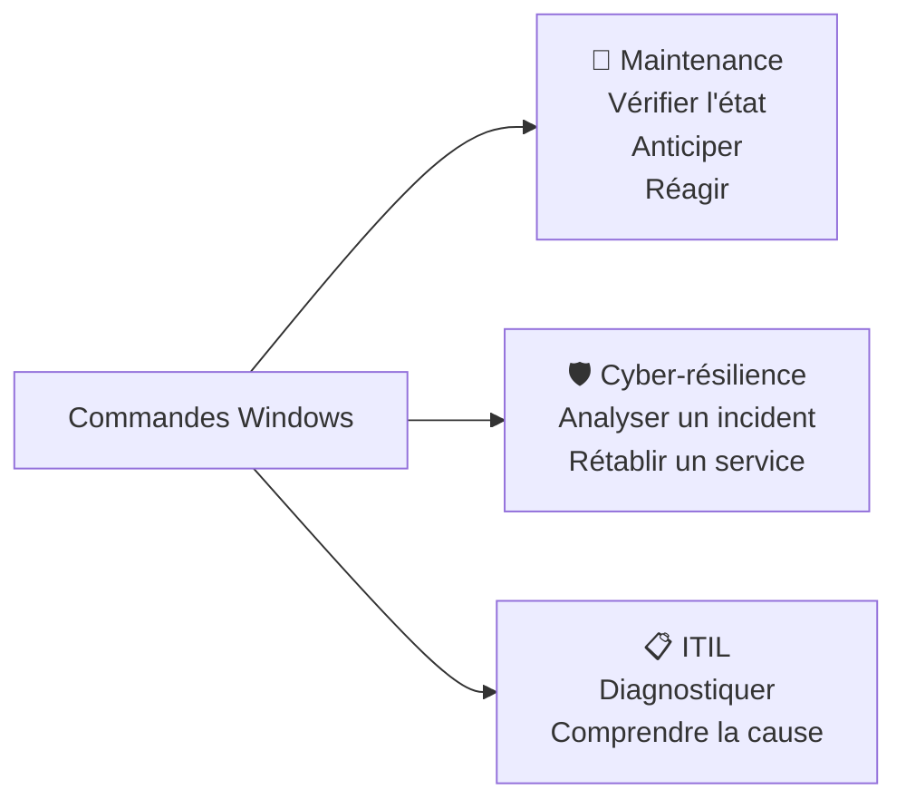

# Commandes Windows essentielles

> **Analogie Cuisine :** Les commandes Windows, ce sont tes **couteaux de chef**. Tu n'as pas besoin de connaître les 300 couteaux existants — mais tu dois maîtriser les 10 essentiels : le couteau d'office (ipconfig), le couteau de chef (sfc), l'économe (tasklist), etc. L'interface graphique, c'est le robot de cuisine — pratique mais limité. Le couteau permet plus de précision et de contrôle.

---

## En une phrase simple
Les commandes Windows (CMD) sont des **outils en ligne de commande** pour diagnostiquer, vérifier et corriger un système — plus rapides et plus précises que l'interface graphique.

## Pourquoi ça existe ?
- Parfois l'interface graphique n'est **pas disponible** (écran noir, mode sans échec)
- Les commandes offrent **plus d'options** que l'interface graphique
- Elles permettent l'**automatisation** via les scripts
- Elles sont **rapides et précises**

---

## Commandes de base par catégorie

### Réseau
| Commande | Rôle | Lien avec la matière |
|----------|------|---------------------|
| `ipconfig` | Voir la config IP (adresse, masque, passerelle) | Diagnostic réseau |
| `ipconfig /all` | Détails complets (DNS, DHCP, MAC) | Analyse approfondie |
| `ping [adresse]` | Tester la connectivité | Vérifier si un hôte répond |
| `tracert [adresse]` | Tracer le chemin réseau | Identifier où ça bloque |
| `nslookup [nom]` | Tester la résolution DNS | DNS fonctionne ? |
| `netstat` | Voir les connexions actives | Sécurité, diagnostic |

### Système
| Commande | Rôle | Lien avec la matière |
|----------|------|---------------------|
| `systeminfo` | Infos complètes du système | Audit, diagnostic |
| `sfc /scannow` | Vérifier/réparer les fichiers système | Maintenance corrective |
| `chkdsk` | Vérifier le disque | Maintenance préventive |
| `tasklist` | Lister les processus | Diagnostic PC lent |
| `taskkill /PID [n]` | Tuer un processus | Intervention corrective |

### Fichiers & Dossiers
| Commande | Rôle |
|----------|------|
| `dir` | Lister le contenu d'un dossier |
| `cd [chemin]` | Changer de répertoire |
| `copy / xcopy / robocopy` | Copier des fichiers |
| `del` | Supprimer un fichier |
| `mkdir / rmdir` | Créer / supprimer un dossier |

### Utilisateurs & Droits
| Commande | Rôle |
|----------|------|
| `whoami` | Voir l'utilisateur connecté |
| `net user` | Lister/gérer les comptes utilisateurs |
| `net localgroup` | Gérer les groupes locaux |

---

## Points d'attention

- **Respecter la syntaxe** — une espace ou un slash de trop = erreur
- **Comprendre AVANT d'exécuter** — surtout en mode administrateur
- **Pas toujours réversible** — `del` ne demande pas de confirmation
- **Vérifier la compatibilité** — certaines commandes dépendent de la version Windows
- **Ne jamais copier-coller un script sans le comprendre**

---

## Lien avec la matière

---

## Connexions
- [[Technique de l'entonnoir]] — les commandes sont les outils de vérification à l'étape 3
- [[Maintenance corrective]] — `sfc /scannow`, `chkdsk` = outils de réparation
- [[Maintenance préventive]] — `chkdsk`, monitoring = prévention
- [[ITIL — Incidents & Problèmes]] — les commandes permettent le diagnostic d'incident

---

## Questions de rappel actif

> **Q :** Internet ne fonctionne pas. Cite 3 commandes à utiliser dans l'ordre pour diagnostiquer.
> **R :** 1. `ipconfig` (vérifier l'IP) → 2. `ping 8.8.8.8` (tester la connectivité) → 3. `nslookup google.com` (tester le DNS).

> **Q :** Quelle commande permet de vérifier et réparer les fichiers système corrompus ?
> **R :** `sfc /scannow` (System File Checker — vérifie l'intégrité des fichiers système et remplace ceux qui sont corrompus).

> **Q :** Pourquoi les commandes sont-elles parfois le seul recours ?
> **R :** Quand l'interface graphique n'est pas disponible (mode sans échec, écran noir, serveur sans interface), les commandes sont le seul moyen d'interagir avec le système.

---

## Pièges fréquents
- ⚠️ **Exécuter en admin sans réfléchir** — Les droits élevés = impact sur tout le système. Une mauvaise commande peut tout casser.
- ⚠️ **`del` ne demande pas confirmation** — Le fichier est supprimé immédiatement, souvent sans passer par la corbeille.
- ⚠️ **Confondre CMD et PowerShell** — CMD = commandes classiques. PowerShell = plus puissant, syntaxe différente. Ce cours couvre CMD.

---

## À retenir absolument
- Les commandes ne sont PAS à mémoriser (300+), mais à COMPRENDRE et UTILISER
- Réseau : `ipconfig` · `ping` · `tracert` · `nslookup`
- Système : `systeminfo` · `sfc /scannow` · `chkdsk` · `tasklist`
- Toujours comprendre AVANT d'exécuter
- CMD = outils de maintenance, cyber-résilience et diagnostic ITIL

## Explorer ensuite
- [[Fiche Examen — Capacités terminales]] — ce qu'on attend de toi le jour de l'évaluation
