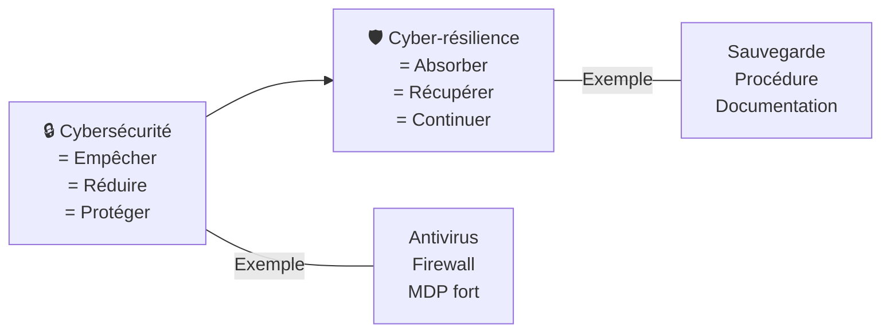
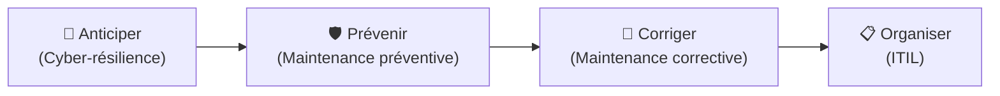

# Cyber-résilience

> **Analogie Restaurant :** La cybersécurité, c'est fermer la porte à clé et installer une alarme (empêcher les intrusions). La cyber-résilience, c'est avoir un **plan B** : si malgré tout un voleur entre, tu as une assurance, des caméras, une copie de ta comptabilité chez ton comptable, et tu peux rouvrir le lendemain. L'un empêche, l'autre encaisse et rebondit.

---

## En une phrase simple
La cyber-résilience, c'est la capacité d'un système à **résister** à un incident, **continuer** à fonctionner, et **récupérer** rapidement.

## Pourquoi ça existe ?
Parce que le risque zéro n'existe pas. Malgré toutes les protections, des incidents arrivent. La question n'est pas "si" mais "quand". Il faut pouvoir encaisser le choc et repartir vite.

---

## Cybersécurité vs Cyber-résilience

| | Cybersécurité | Cyber-résilience |
|-|--------------|-----------------|
| **Objectif** | Empêcher les attaques | Récupérer après un incident |
| **Approche** | Défensive | Adaptative |
| **Question** | Comment empêcher ? | Comment rebondir ? |
| **Exemples** | Antivirus, firewall, MDP | Sauvegarde, plan de reprise, documentation |

---

## Les 4 piliers de la cyber-résilience

| Pilier | Action | Exemple concret |
|--------|--------|-----------------|
| **Responsabilités claires** | Savoir qui fait quoi en cas d'incident | Qui décide de restaurer ? Qui informe les users ? |
| **Communication maîtrisée** | Informer en interne et en externe | "Le service est indisponible, retour estimé à 14h" |
| **Documentation utile** | Tracer les actions, capitaliser | Rapport d'incident, historique des actions |
| **Procédures simples** | Agir vite sans improviser | Checklist de réaction, procédure de restauration |

---

## Catégorisation des risques sur un poste Windows

| Catégorie | Exemples |
|-----------|----------|
| **Humain** | Mot de passe faible, clic sur lien phishing, suppression accidentelle |
| **Logiciel** | Malware, bug, mise à jour défaillante |
| **Matériel** | Disque HS, vol de PC, panne électrique |
| **Organisation** | Pas de sauvegarde, pas de procédure, pas de formation |

---

## Cas concret — PC portable perdu dans le train

| Aspect | Ce qui est perdu | Ce qui est exposé | Ce qui aurait limité les dégâts |
|--------|-----------------|-------------------|-------------------------------|
| **Disponibilité** | Cours, travaux, notes, temps | — | Copie sur cloud/disque externe |
| **Confidentialité** | — | MDP enregistrés, données privées, comptes | Chiffrement (BitLocker), MDP fort |
| **Réaction** | — | — | Procédure : changer MDP → bloquer compte → restaurer |

> Combien de temps pour se remettre à travailler ? C'est LA question de la cyber-résilience.

---

## Lien avec le cadre légal (pour info)

- **RGPD** (Règlement Général sur la Protection des Données) — impose des principes qui rendent la cyber-résilience indispensable
- **NIS2** (Network and Information Security Directive) — directive européenne qui exige explicitement la continuité des services face aux incidents cyber

> Ce qu'on apprend ici (sauvegardes, documentation, procédures, récupération) n'est pas "du confort" — c'est ce que la loi attend des organisations.

---

## Le fil rouge du cours

---

## Connexions
- [[Maintenance préventive]] — composante majeure de la cyber-résilience
- [[Sauvegardes — Types & stratégies]] — sans sauvegarde, pas de résilience
- [[ITIL — Incidents & Problèmes]] — ITIL structure la gestion d'incident
- [[Bon & mauvais usage de l'IA]] — l'IA comme outil, pas comme décideur
- [[Checklists]] — outil de réaction rapide en cas d'incident

---

## Questions de rappel actif

> **Q :** Quelle est la différence fondamentale entre cybersécurité et cyber-résilience ?
> **R :** Cybersécurité = empêcher les incidents (antivirus, firewall). Cyber-résilience = pouvoir récupérer quand un incident arrive malgré tout (sauvegarde, procédure, plan de reprise).

> **Q :** Un étudiant perd son PC portable. Cite 3 mesures de cyber-résilience qui auraient limité l'impact.
> **R :** 1. Sauvegarde des fichiers sur disque externe / cloud · 2. Chiffrement du disque (BitLocker) · 3. Procédure de réaction : changer les MDP, bloquer les comptes.

---

## Pièges fréquents
- ⚠️ **"J'ai un antivirus donc je suis protégé"** — L'antivirus = cybersécurité. Mais si le PC est volé ou le disque meurt, l'antivirus ne récupère rien. Il faut aussi la résilience.
- ⚠️ **Ne pas tester les sauvegardes** — Une sauvegarde jamais testée n'est pas une sauvegarde. La résilience se vérifie.

---

## À retenir absolument
- Cyber-résilience = résister + continuer + récupérer
- 4 piliers : responsabilités · communication · documentation · procédures
- AVANT = préventive + cyber-résilience · PENDANT = corrective + gestion d'incident (ITIL)
- Risque zéro n'existe pas — la question est "combien de temps pour repartir ?"
- RGPD et NIS2 imposent la cyber-résilience aux organisations

## Explorer ensuite
- [[Bon & mauvais usage de l'IA]] — comment utiliser l'IA sans créer de nouveaux risques
