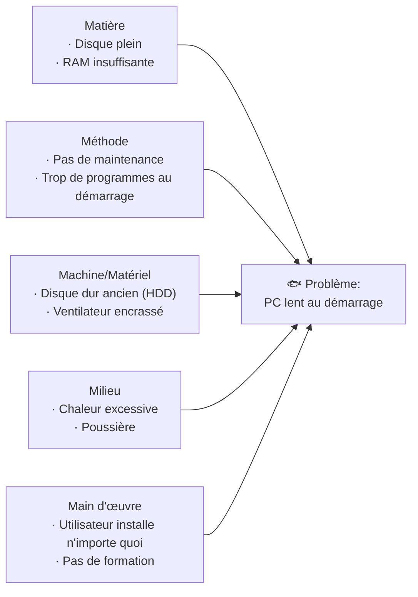

# Diagramme d'Ishikawa

> **Analogie Restaurant :** Tu es chef de cuisine et un client signale une intoxication alimentaire. Tu ne cherches pas au hasard — tu explores **5 pistes** : les ingrédients (Matière), la recette suivie (Méthode), l'état du four/frigos (Matériel), la propreté de la cuisine (Milieu), et les cuisiniers (Main d'œuvre). C'est exactement ce que fait Ishikawa : structurer ta recherche de causes au lieu de deviner.

---

## En une phrase simple
Le diagramme d'Ishikawa (aussi appelé diagramme en arêtes de poisson) est un outil visuel qui organise les **causes possibles** d'un problème en catégories pour ne rien oublier.

## Pourquoi ça existe ?
Face à un problème (PC lent, panne réseau, erreur logicielle), on a tendance à sauter sur la première idée. Ishikawa force à **explorer toutes les pistes** avant de choisir laquelle vérifier.

---

## Comment ça fonctionne ?

### Étape 1 — Définir le problème
Le problème est écrit à droite (la tête du poisson). Il doit être **précis et factuel**.
- ❌ "Ça marche pas" → trop vague
- ✅ "Le PC de l'accueil met 5 min à démarrer" → exploitable

### Étape 2 — Lister les causes possibles par catégorie (5M)

### Les 5M (version de base)

| M | Signification | En informatique |
|---|--------------|-----------------|
| **Matière** | Ce qui sert à créer le produit/service | Données, fichiers, logiciels |
| **Méthode** | Façon de faire, mode opératoire | Procédures, configurations |
| **Machine/Matériel** | Moyens techniques | Hardware, câbles, réseau |
| **Milieu** | Environnement de travail | Température, poussière, électricité |
| **Main d'œuvre** | Personnel et qualifications | Utilisateurs, admin, formation |

### Les 9M (version étendue)
Aux 5M de base, on peut ajouter : **Management**, **Maintenance**, **Moyens financiers**, **Mesure**.

### Étape 3 — Prioriser et vérifier
On ne teste pas tout en même temps. On commence par les causes les **plus probables** (expérience + statistiques).

---

## Exemple concret
**Problème** : Intoxication alimentaire dans un restaurant

| 5M | Causes possibles |
|----|-----------------|
| Matière | Ingrédients contaminés, DLC dépassée |
| Méthode | Mode de conservation incorrect |
| Matériel | Ustensiles non lavés, plan de travail sale |
| Milieu | Plat laissé à l'air libre |
| Main d'œuvre | Personnel malade, mains non lavées |

---

## Connexions
- [[Technique de l'entonnoir]] — Ishikawa est la première étape de l'entonnoir de diagnostic
- [[Matrice d'Eisenhower]] — après avoir trouvé les causes, Eisenhower aide à prioriser
- [[ITIL — Incidents & Problèmes]] — Ishikawa sert dans l'analyse de problème (cause profonde)
- [[Maintenance corrective]] — identifier les causes pour réparer correctement

---

## Questions de rappel actif

> **Q :** Cite les 5M du diagramme d'Ishikawa et donne un exemple informatique pour chacun.
> **R :** Matière (fichier corrompu) · Méthode (pas de procédure de sauvegarde) · Machine (disque dur défaillant) · Milieu (surchauffe du serveur) · Main d'œuvre (utilisateur a supprimé un fichier système).

> **Q :** Pourquoi ne faut-il PAS chercher directement la solution sans faire un Ishikawa ?
> **R :** Parce qu'on risque de traiter un symptôme au lieu de la cause réelle. Ishikawa force à explorer toutes les pistes possibles avant de décider laquelle vérifier.

> **Q :** Quelle est la différence entre les 5M et les 9M ?
> **R :** Les 9M ajoutent Management, Maintenance, Moyens financiers et Mesure. Utile pour des problèmes organisationnels plus complexes, pas seulement techniques.

---

## Pièges fréquents
- ⚠️ **"Je connais déjà la cause"** — Le biais de confirmation est l'ennemi du diagnostic. Ishikawa oblige à considérer TOUTES les pistes.
- ⚠️ **Problème trop vague** — "Ça bug" n'est pas exploitable. Il faut un énoncé précis.
- ⚠️ **Confondre cause et symptôme** — "Le PC est lent" est un symptôme. "Le disque est plein à 98%" est une cause.

---

## À retenir absolument
- 5M = Matière · Méthode · Machine · Milieu · Main d'œuvre
- Le problème se met à droite (tête du poisson), les causes à gauche
- C'est un outil d'**exploration**, pas de résolution — il liste les pistes
- Toujours commencer par un énoncé de problème précis et factuel

## Explorer ensuite
- [[Technique de l'entonnoir]] — comment vérifier et éliminer les causes trouvées
