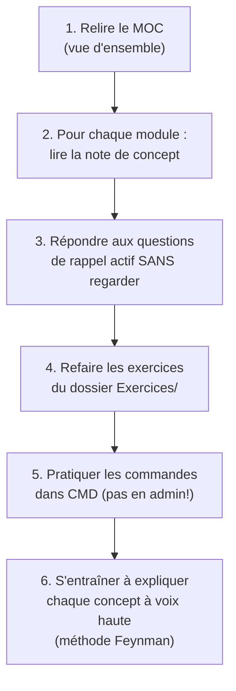

# Fiche Examen — Capacités terminales

> **Ce que la prof attend le jour J** — Cette fiche résume les critères d'évaluation officiels du dossier pédagogique et les informations données en cours.

---

## Structure de l'évaluation

| Partie | Poids | Format | Date |
|--------|-------|--------|------|
| **1. Ateliers** | 1/3 | Animation d'un atelier + documentation | Déjà réalisé |
| **2. Évaluation écrite** | 1/3 | Scripts + mises en situation + QCM (sur ordi, temps limité) | 28/05/26 |
| **3. Projet serveurs** | 1/3 | Projet Agile en équipe + documentation + présentation orale | 25/06/26 |

> **Chaque partie DOIT être réussie.** Échec = 2nde session fin août.

---

## La capacité terminale unique (à réussir OBLIGATOIREMENT)

> Face à une situation-problème couramment rencontrée dans l'administration et la gestion d'un système d'exploitation, **mettre en œuvre et justifier une démarche de résolution de problèmes** pour :
> 1. **Adaptation et personnalisation** d'un système
> 2. **Remédiation à un dysfonctionnement** de type courant
> 3. **Élaboration de procédures** en langage de commande

---

## Critères d'évaluation détaillés

### 1. Adaptation et personnalisation du système

| Critère | Ce qu'on vérifie |
|---------|-----------------|
| Identification du besoin | Tu repères correctement les besoins techniques |
| Choix techniques pertinents | Tu sélectionnes les bons outils/paramètres |
| Mise en œuvre | Tu appliques les modifications sans créer d'erreurs supplémentaires |
| Documentation | Les changements sont documentés avec vocabulaire technique |

### 2. Remédiation à un dysfonctionnement

| Critère | Ce qu'on vérifie |
|---------|-----------------|
| Diagnostic | Tu repères le dysfonctionnement et identifies son origine |
| Planification | Tu détermines la séquence logique pour résoudre |
| Mise en œuvre | Tu appliques les actions correctives de manière sécurisée |
| Vérification | Tu testes la solution et confirmes que c'est résolu |

### 3. Élaboration de procédures en langage de commande

| Critère | Ce qu'on vérifie |
|---------|-----------------|
| Syntaxe et structure | Le script respecte la syntaxe, les options, les structures de contrôle |
| Fonctionnalité | Le script fonctionne et gère les erreurs |
| Lisibilité | Commentaires et structure corrects |
| Justification | Tu expliques la logique et le fonctionnement |

---

## Degré de maîtrise (les 5 critères bonus)

Au-delà du seuil de réussite, on évalue :
1. **Rigueur** et respect des spécificités du système d'exploitation
2. **Comportements professionnels**
3. **Adéquation** de la solution
4. **Respect du temps** alloué
5. **Clarté et précision** du vocabulaire technique

---

## Matière à maîtriser pour l'évaluation écrite (28/05/26)

- [ ] Analyse & résolution de problèmes (Ishikawa, 5 Pourquoi, entonnoir)
- [ ] Cyber-résilience
- [ ] ITIL (incident vs problème)
- [ ] Les maintenances (corrective, préventive, logicielle, évolutive)
- [ ] Communication et comportements professionnels
- [ ] Sauvegardes, synchronisation, restauration, rollback
- [ ] Les différents types de procédures (logigrammes, checklists, RAD)
- [ ] Les commandes Windows de base
- [ ] Bases de scripting PowerShell

---

## Projet serveurs (à partir du 28/05/26)

- Projet **Agile en équipe**
- Rapports **individuels** sur Moodle CHAQUE semaine (obligatoire)
- Répartition **équitable** des tâches
- Documentation dans les délais
- Présentation orale le **25/06/26**

---

## Connexions
- [[MOC — Systèmes d'exploitation]] — vue d'ensemble de toute la matière
- Tous les concepts de ce vault couvrent la matière d'examen

---

## Conseil de révision

