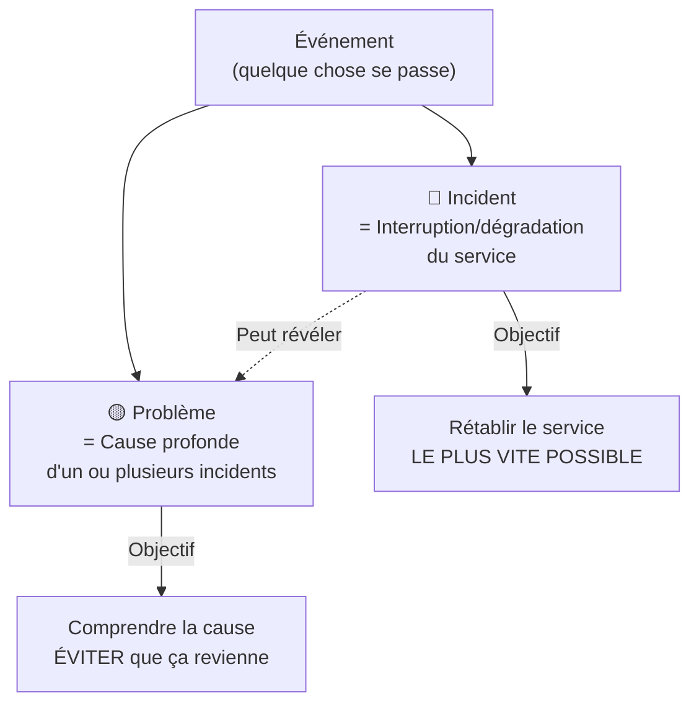
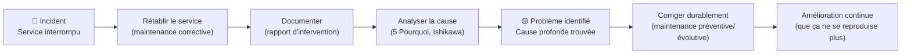

# ITIL — Incidents & Problèmes

> **Analogie Restaurant :** Un client reçoit un plat froid (incident). Tu ne fais pas attendre le client le temps de comprendre pourquoi le four déconne — tu lui refais le plat immédiatement (rétablir le service). ENSUITE, tu vérifies le four, tu diagnostiques la panne, et tu la corriges pour que ça n'arrive plus (problème). ITIL (Information Technology Infrastructure Library — bibliothèque de bonnes pratiques pour gérer les services IT), c'est exactement ça : **d'abord le client, ensuite l'enquête**.

---

## En une phrase simple
ITIL distingue deux choses : un **incident** (ça casse → on rétablit vite le service) et un **problème** (pourquoi ça casse → on trouve et élimine la cause profonde).

---

## La distinction fondamentale

| | Incident | Problème |
|-|----------|----------|
| **C'est quoi** | Interruption ou dégradation du service | Cause profonde d'un ou plusieurs incidents |
| **Objectif** | Rétablir le service vite | Comprendre et éliminer la cause |
| **Maintenance** | Corrective (palliative/curative) | Préventive / Évolutive |
| **Urgence** | Élevée | Variable |
| **Approche** | Orienté **service** | Orienté **analyse** |

---

## Orienté SERVICE vs orienté SOLUTION

> Un technicien "orienté solution" **répare le problème**.
> Un professionnel "orienté service" **permet aux utilisateurs de continuer à travailler**.

ITIL parle d'"orienté service" parce que dans une organisation :
- Les systèmes sont complexes
- Réparer peut prendre longtemps
- **L'activité métier doit continuer**

→ On privilégie de rétablir le service rapidement, puis seulement d'analyser la cause.

---

## Le cycle complet

---

## Exemples concrets

| Situation | Incident ou Problème ? | Action |
|-----------|----------------------|--------|
| L'imprimante ne répond plus | Incident | Redémarrer le service d'impression |
| L'imprimante plante 3× par semaine | Problème | Analyser : driver ? réseau ? matériel ? |
| Un utilisateur ne peut plus accéder à ses fichiers | Incident | Vérifier les permissions, rétablir l'accès |
| Les permissions se réinitialisent après chaque mise à jour | Problème | Analyser la GPO, corriger la config |
| Le VPN coupe après 10 min | Incident | Reconnecter l'utilisateur |
| Le VPN coupe régulièrement | Problème | Analyser les logs réseau, corriger la config |

---

## La philosophie ITIL en 3 phrases

1. **Réparer un problème, c'est bien.**
2. **Comprendre pourquoi il est arrivé, c'est mieux.**
3. **Faire en sorte qu'il n'arrive plus, c'est professionnel.**

---

## Connexions
- [[Technique de l'entonnoir]] — la méthode de diagnostic pour analyser un problème
- [[Diagramme d'Ishikawa]] — outil pour trouver la cause profonde
- [[Maintenance corrective]] — l'incident déclenche une corrective
- [[Maintenance préventive]] — le problème résolu mène à de la préventive
- [[Rapport d'intervention]] — documenter chaque incident/problème
- [[Cyber-résilience]] — ITIL + cyber-résilience = gestion complète des incidents

---

## Questions de rappel actif

> **Q :** Le serveur mail plante. Les utilisateurs ne peuvent plus envoyer d'emails. C'est un incident ou un problème ?
> **R :** C'est un incident (service interrompu). On rétablit le service d'abord. Si le serveur plante régulièrement, c'est un problème (cause profonde à analyser).

> **Q :** Pourquoi ITIL dit "orienté service" plutôt que "orienté solution" ?
> **R :** Parce que l'objectif n'est pas seulement de résoudre le problème technique, mais de permettre aux utilisateurs de continuer à travailler. Le service à l'utilisateur prime sur la perfection technique.

> **Q :** Quel lien entre incident ITIL et maintenance corrective ?
> **R :** Un incident déclenche une maintenance corrective. D'abord palliative (rétablir le service) puis curative (corriger la cause).

---

## Pièges fréquents
- ⚠️ **Confondre incident et problème** — L'incident est le symptôme visible (service down). Le problème est la cause cachée (config erronée).
- ⚠️ **Ne traiter que les incidents** — Si on ne passe jamais à l'analyse de problème, les mêmes incidents reviennent en boucle.
- ⚠️ **"Orienté solution" suffit** — Non. Résoudre sans comprendre = problème récurrent. ITIL pousse à l'amélioration continue.

---

## À retenir absolument
- Incident = interruption du service → rétablir VITE
- Problème = cause profonde → comprendre et empêcher la récurrence
- Orienté SERVICE = l'utilisateur d'abord, la technique ensuite
- Cycle : Incident → Rétablir → Documenter → Analyser → Corriger → Prévenir
- "Un bon informaticien n'est pas celui qui répare vite, c'est celui qui empêche les problèmes d'arriver et qui sait les gérer quand ils arrivent"

## Explorer ensuite
- [[Cyber-résilience]] — la vision globale qui englobe ITIL + prévention + récupération
