# 🗺️ Systèmes d'exploitation — Map of Content

> **Résumé express** : Ce cours, c'est comme gérer un **restaurant**. L'OS est la cuisine — personne ne la voit mais tout en dépend. La maintenance, c'est l'entretien des équipements avant que le frigo lâche en plein service. ITIL, c'est le protocole quand un plat rate : on sert d'abord un remplacement au client (rétablir le service), puis on cherche pourquoi ça a raté (cause profonde). Les sauvegardes ? C'est le congélateur de secours. Les commandes Windows ? Ce sont vos couteaux de chef.
>
> 📐 Carte visuelle interactive → voir [[Systèmes d'exploitation — Parcours.canvas]]

---

## Parcours d'apprentissage recommandé

```mermaid
flowchart LR
    M1["🔍 1\nRésolution\nde problèmes"] --> M2["🔧 2\nMaintenances"]
    M2 --> M3["📋 3\nITIL"]
    M3 --> M4["🛡️ 4\nCyber-\nrésilience"]
    M4 --> M5["💾 5\nSauvegardes\n& Restauration"]
    M5 --> M6["💬 6\nCommunication\nprofessionnelle"]
    M6 --> M7["📝 7\nDocumentation\n& Procédures"]
    M7 --> M8["☁️ 8\nCloud"]
    M8 --> M9["⌨️ 9\nCommandes\nWindows"]

    style M1 fill:#c6efce,stroke:#538135
    style M2 fill:#c6efce,stroke:#538135
    style M3 fill:#c6efce,stroke:#538135
    style M4 fill:#ffeb9c,stroke:#9c6500
    style M5 fill:#ffeb9c,stroke:#9c6500
    style M6 fill:#ffeb9c,stroke:#9c6500
    style M7 fill:#e2b0ff,stroke:#7030a0
    style M8 fill:#e2b0ff,stroke:#7030a0
    style M9 fill:#e2b0ff,stroke:#7030a0
```

---

## 🔍 Module 1 — Résolution de problèmes
*La base de tout — comment un technicien pense*

| Concept | En 5 mots | Note |
|---------|-----------|------|
| [[Diagramme d'Ishikawa]] | Causes possibles via les 5M | |
| [[Matrice d'Eisenhower]] | Urgent vs important = priorités | |
| [[Technique de l'entonnoir]] | Catégoriser → Hypothèses → Éliminer | |

---

## 🔧 Module 2 — Maintenances
*Entretenir avant que ça casse*

| Concept | En 5 mots | Note |
|---------|-----------|------|
| [[Maintenance corrective]] | Réparer quand c'est cassé | |
| [[Maintenance préventive]] | Éviter les pannes futures | |
| [[Maintenance logicielle & évolutive]] | Patcher, adapter, améliorer les logiciels | |

---

## 📋 Module 3 — ITIL
*Organiser la gestion des incidents en pro*

| Concept | En 5 mots | Note |
|---------|-----------|------|
| [[ITIL — Incidents & Problèmes]] | Incident = réparer · Problème = comprendre | |

---

## 🛡️ Module 4 — Cyber-résilience
*Se relever vite après un incident*

| Concept | En 5 mots | Note |
|---------|-----------|------|
| [[Cyber-résilience]] | Résister, continuer, récupérer rapidement | |
| [[Bon & mauvais usage de l'IA]] | Outil d'aide, jamais de décision | |

---

## 💾 Module 5 — Sauvegardes & Restauration
*Le filet de sécurité indispensable*

| Concept | En 5 mots | Note |
|---------|-----------|------|
| [[Sauvegardes — Types & stratégies]] | Locale, NAS, cloud, complète, incrémentielle | |
| [[Règle 3-2-1]] | 3 copies, 2 supports, 1 hors-site | |
| [[Synchronisation vs Sauvegarde]] | Miroir ≠ protection contre suppression | |
| [[Restauration & Rollback]] | Revenir en arrière après incident | |

---

## 💬 Module 6 — Communication professionnelle
*Parler aux humains, pas qu'aux machines*

| Concept | En 5 mots | Note |
|---------|-----------|------|
| [[Reformulation & Vulgarisation]] | Reformuler le client, simplifier le jargon | |
| [[Ton professionnel & Gestion de crise]] | Rester calme face au stress | |

---

## 📝 Module 7 — Documentation & Procédures
*Tracer, expliquer, standardiser*

| Concept | En 5 mots | Note |
|---------|-----------|------|
| [[Rapport d'intervention]] | Fiche de ce qui a été fait | |
| [[Procédures & Logigrammes]] | Mode d'emploi pas à pas | |
| [[Checklists]] | Ne rien oublier pendant l'action | |

---

## ☁️ Module 8 — Cloud
*Comprendre où vivent vos données*

| Concept | En 5 mots | Note |
|---------|-----------|------|
| [[Cloud — SaaS PaaS IaaS]] | Trois niveaux de service cloud | |

---

## ⌨️ Module 9 — Commandes Windows
*Les outils du technicien en ligne de commande*

| Concept | En 5 mots | Note |
|---------|-----------|------|
| [[Commandes Windows essentielles]] | Diagnostiquer, vérifier, corriger via CMD | |

---

## 🎯 Fiche Examen

| [[Fiche Examen — Capacités terminales]] | Ce qu'on attend de toi le jour J |

---

## Questions de révision globale

> **Q :** Un utilisateur appelle : "Mon PC est lent, rien ne marche !" Décris les étapes de ta démarche de A à Z.
> **R :** 1. Reformuler le problème avec l'utilisateur · 2. Catégoriser (Hardware? Réseau? Logiciel? Utilisateur?) · 3. Émettre des hypothèses (disque plein? virus? RAM saturée?) · 4. Vérifier via technique de l'entonnoir (Ishikawa → 5 Pourquoi → arbre de décision) · 5. Intervenir (maintenance corrective) · 6. Documenter (rapport d'intervention) · 7. Prévenir (checklist, maintenance préventive).

> **Q :** Quelle est la différence entre un incident et un problème au sens ITIL ?
> **R :** Incident = interruption/dégradation du service → objectif : rétablir vite. Problème = cause profonde d'un ou plusieurs incidents → objectif : comprendre et empêcher que ça se reproduise.

> **Q :** OneDrive est-il une sauvegarde ? Pourquoi ?
> **R :** Non. OneDrive est une synchronisation (miroir). Si tu supprimes un fichier → il disparaît partout. Une vraie sauvegarde conserve un historique indépendant et protège contre la suppression accidentelle.

---

## 📁 Fichiers source du cours
- `Cours1.pdf` — Intro, Ishikawa, Eisenhower, gestion du temps
- `Cours6.pdf` — Maintenances, procédures, logigrammes, RAD
- `Cours7_ITIL.pdf` — ITIL, procédures, checklists, communication
- `Cours8_Asynchrone.pdf` — Analyse technique, communication, documentation
- `Cours9_Sauvegardes.pdf` — Sauvegardes, restauration, types
- `Cours10.pdf` — Cloud, rollback, checklists, procédures utilisateurs
- `Cours11.pdf` — Commandes Windows, planning évaluations
- `Cours12.pdf` — Commandes Windows suite
- `Cours_Cyber.pdf` — Cyber-résilience, IA, ticketing
- `Cours_ComportementsProfess.pdf` — Charte comportements, rétrospective Agile
