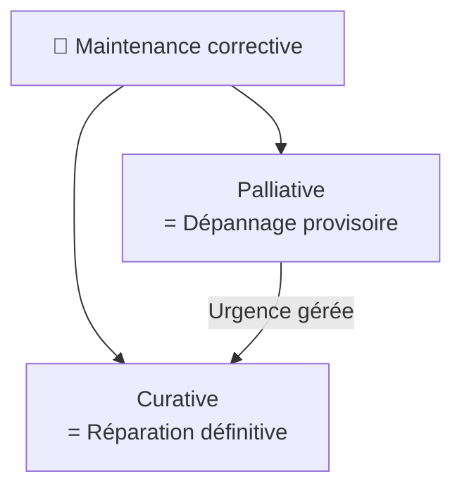
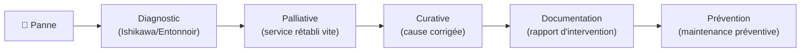

# Maintenance corrective

> **Analogie Restaurant :** Le frigo tombe en panne en plein service. Deux options : (1) **palliative** — tu mets les denrées dans une glacière de fortune pour finir le service (dépannage provisoire), puis (2) **curative** — le lendemain tu fais réparer ou remplacer le frigo (réparation définitive). L'un gère l'urgence, l'autre résout le vrai problème.

---

## En une phrase simple
La maintenance corrective, c'est **réparer quand c'est déjà cassé** — remettre un équipement en état de fonctionner après une panne.

## Pourquoi ça existe ?
Malgré toute la prévention du monde, les pannes arrivent. Il faut savoir réagir vite (palliative) puis résoudre durablement (curative).

---

## Les deux sous-types

### Palliative (dépannage provisoire)
- Remettre le service **rapidement**, même avec une solution temporaire
- La solution reste **fragile** — elle doit être suivie d'une curative
- Exemples IT :
  - Redémarrer un service planté
  - Brancher un câble réseau de remplacement
  - Utiliser un PC de prêt
  - Restaurer une sauvegarde rapide

### Curative (réparation définitive)
- Réparer le dysfonctionnement **à la source** et remettre le système dans son état initial
- Exemples IT :
  - Remplacer un disque dur défaillant
  - Réinstaller un OS corrompu
  - Corriger une configuration réseau
  - Appliquer un patch de sécurité

---

## Flux de résolution

---

## Les 6 actions de maintenance

| Action | Définition |
|--------|-----------|
| **Dépannage** | Remettre en état de fonctionner |
| **Réparation** | Faire disparaître un dysfonctionnement |
| **Réglage** | Mettre au point le fonctionnement |
| **Révision** | Examiner de nouveau, mettre à jour |
| **Contrôle** | Surveiller le fonctionnement |
| **Vérification** | Confronter aux faits pour tester l'exactitude |

---

## Connexions
- [[Technique de l'entonnoir]] — méthode de diagnostic qui précède l'intervention corrective
- [[Maintenance préventive]] — l'inverse de la corrective : éviter la panne au lieu de la subir
- [[ITIL — Incidents & Problèmes]] — incident ITIL = maintenance corrective
- [[Rapport d'intervention]] — toute corrective doit être documentée
- [[Restauration & Rollback]] — une forme de maintenance corrective (revenir en arrière)

---

## Questions de rappel actif

> **Q :** Quelle est la différence entre maintenance palliative et curative ?
> **R :** Palliative = dépannage provisoire pour rétablir le service rapidement (fragile). Curative = réparation définitive qui traite la cause du dysfonctionnement.

> **Q :** Un serveur web plante. Tu le redémarres. C'est quel type de maintenance ?
> **R :** Palliative — le service est rétabli mais la cause du plantage n'est pas traitée. Il faut ensuite analyser les logs et corriger la cause (curative).

---

## Pièges fréquents
- ⚠️ **S'arrêter au palliative** — Redémarrer un service qui plante tous les jours n'est pas une solution. La curative doit suivre.
- ⚠️ **Confondre corrective et préventive** — Corrective = APRÈS la panne. Préventive = AVANT la panne.

---

## À retenir absolument
- Corrective = réparer après la panne
- Palliative = provisoire et rapide · Curative = définitive
- Toujours : palliative (urgence) → curative (cause) → documentation → prévention
- 6 actions : dépannage, réparation, réglage, révision, contrôle, vérification

## Explorer ensuite
- [[Maintenance préventive]] — comment éviter d'en arriver à la corrective
