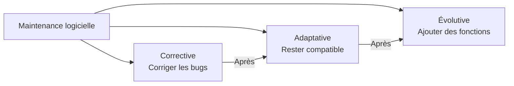

# Maintenance logicielle & évolutive

> **Analogie Cuisine :** Corrective logicielle = ton four ne chauffe plus correctement, tu fais venir le technicien qui met à jour le firmware. Adaptative = le fabricant sort une nouvelle version du four, tu adaptes tes recettes pour rester compatible. Évolutive = tu ajoutes un module vapeur à ton four pour faire de nouvelles recettes — le four de base marche bien, mais tu veux plus de fonctionnalités.

---

## En une phrase simple
Les maintenances logicielles concernent les **corrections, adaptations et améliorations** des logiciels et applications, par opposition à la maintenance matérielle.

---

## Les 3 types

| Type | Objectif | Exemple |
|------|----------|---------|
| **Corrective** | Corriger un bug ou défaut | Patch qui corrige un crash d'application |
| **Adaptative** | Rester compatible avec l'environnement | Mise à jour d'un driver pour Windows 11 |
| **Évolutive** | Ajouter des fonctionnalités | Ajout d'un module de reporting à un ERP |

---

## Connexions
- [[Maintenance corrective]] — la corrective logicielle est un sous-ensemble de la corrective générale
- [[Maintenance préventive]] — les mises à jour régulières (adaptative) sont une forme de prévention
- [[Sauvegardes — Types & stratégies]] — toujours sauvegarder AVANT une mise à jour logicielle

---

## Questions de rappel actif

> **Q :** Quelle est la différence entre maintenance corrective et adaptative en logiciel ?
> **R :** Corrective = corriger un bug/défaut existant. Adaptative = adapter le logiciel à un nouvel environnement (nouvelle version d'OS, nouveau hardware).

---

## Pièges fréquents
- ⚠️ **Confondre mise à jour corrective et évolutive** — Un patch de sécurité = corrective. Une nouvelle fonctionnalité = évolutive. Pas le même risque.

---

## À retenir absolument
- Corrective = réparer un bug · Adaptative = rester compatible · Évolutive = améliorer
- L'évolutive n'est pas officiellement reconnue comme "vraie" catégorie de maintenance mais elle est essentielle
- Toujours sauvegarder AVANT toute maintenance logicielle

## Explorer ensuite
- [[ITIL — Incidents & Problèmes]] — comment ITIL organise la gestion de ces maintenances
