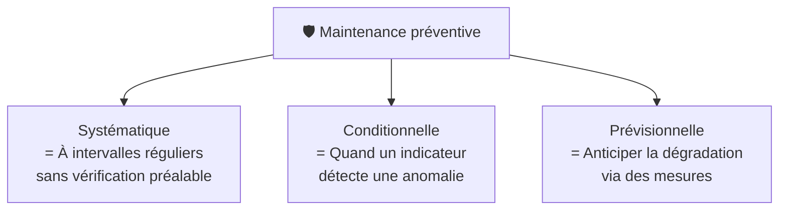

# Maintenance préventive

> **Analogie Restaurant :** Chaque matin avant l'ouverture, tu vérifies les frigos (température OK ?), tu nettoies les plans de travail, tu vérifies les stocks et les DLC. Tu ne fais pas ça parce que quelque chose est cassé — tu le fais pour que **rien ne casse pendant le service**. C'est la maintenance préventive : agir AVANT le problème.

---

## En une phrase simple
La maintenance préventive, c'est **entretenir et vérifier AVANT qu'une panne arrive** pour éviter les incidents et réduire les risques.

## Pourquoi ça existe ?
Souvent, on réalise l'importance de la maintenance quand il est trop tard — quand la panne arrive ou quand les données sont perdues. Prévenir coûte toujours moins cher que réparer.

---

## Les 3 sous-types

### Systématique
- Exécutée à **intervalles réguliers** (toutes les semaines, tous les mois)
- Sans contrôle préalable de l'état du bien
- Exemples IT : mises à jour Windows planifiées, sauvegardes quotidiennes, nettoyage disque mensuel

### Conditionnelle
- Intervient quand un **indicateur détecte une anomalie**
- Suppose des outils de surveillance (monitoring)
- Exemples IT : alerte disque plein à 80%, température CPU trop haute, service qui consomme trop de RAM

### Prévisionnelle
- Mesure la **dégradation progressive** avant la défaillance
- Exemples IT : durée de vie estimée d'un SSD (compteur SMART), analyse des logs de performance, monitoring de latence réseau

---

## Exemples concrets en IT

| Action préventive | Ce qu'elle évite |
|-------------------|-----------------|
| Mises à jour régulières | Failles de sécurité exploitées |
| Sauvegardes planifiées | Perte de données irréversible |
| Monitoring (CPU, RAM, disque) | Panne surprise du serveur |
| Documentation des installations | Perte de temps en cas de réinstallation |
| Séparation comptes admin/user | Erreurs irréversibles par l'utilisateur |
| Partitionnement du disque | Perte de données si réinstallation OS |
| Tests en VM avant déploiement | Crash en production |

---

## Lien avec la gestion des risques

| Concept | Définition |
|---------|-----------|
| **Danger** | Ce qui PEUT causer un dommage (l'électricité) |
| **Risque** | La PROBABILITÉ d'un dommage lié au danger (se faire électrocuter) |

La maintenance préventive **réduit le risque** sans éliminer le danger.

> Ta capacité à anticiper révèle ta maîtrise.

---

## Connexions
- [[Maintenance corrective]] — la corrective arrive quand la préventive a échoué ou n'existe pas
- [[Sauvegardes — Types & stratégies]] — les sauvegardes planifiées = maintenance préventive par excellence
- [[Checklists]] — l'outil pour ne rien oublier dans les routines préventives
- [[Cyber-résilience]] — la préventive est une composante majeure de la cyber-résilience
- [[Matrice d'Eisenhower]] — la préventive = quadrant Q2 (important mais pas urgent)

---

## Questions de rappel actif

> **Q :** Cite les 3 sous-types de maintenance préventive avec un exemple IT chacun.
> **R :** Systématique (mises à jour planifiées chaque mardi) · Conditionnelle (alerte quand le disque atteint 80%) · Prévisionnelle (analyse SMART du SSD qui prédit la fin de vie).

> **Q :** Pourquoi la maintenance préventive se situe dans le quadrant Q2 d'Eisenhower ?
> **R :** Parce qu'elle est importante (évite des crises futures) mais pas urgente (rien n'est cassé maintenant). C'est le quadrant stratégique.

---

## Pièges fréquents
- ⚠️ **"Tout fonctionne, pas besoin de maintenance"** — C'est justement quand tout va bien qu'il faut prévenir. Attendre la panne = maintenance corrective subie.
- ⚠️ **Confondre préventive et corrective** — Préventive = AVANT la panne. Corrective = APRÈS la panne.

---

## À retenir absolument
- Préventive = agir AVANT le problème
- Systématique (régulier) · Conditionnelle (détection) · Prévisionnelle (mesure)
- Danger ≠ Risque (le danger existe, le risque est la probabilité)
- Plus on investit en prévention, moins on subit de crises
- La maintenance préventive est une composante clé de la cyber-résilience

## Explorer ensuite
- [[Maintenance logicielle & évolutive]] — les maintenances spécifiques au logiciel
