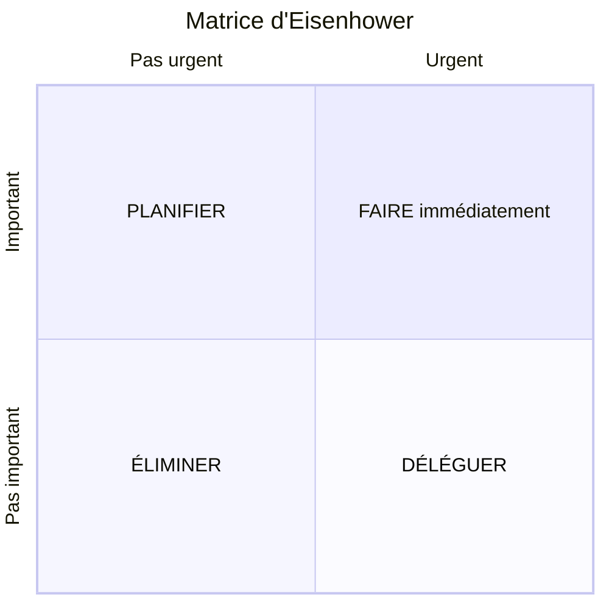

# Matrice d'Eisenhower

> **Analogie Restaurant :** En plein service du samedi soir : une table réclame son plat (urgent + important → FAIRE), tu dois planifier le menu de la semaine prochaine (important mais pas urgent → PLANIFIER), un livreur sonne pour les serviettes (urgent mais pas important → DÉLÉGUER), un commercial t'appelle pour te vendre des sets de table → IGNORER.

---

## En une phrase simple
La matrice d'Eisenhower classe chaque tâche selon deux axes — **urgence** et **importance** — pour décider quoi faire maintenant, planifier, déléguer ou éliminer.

## Pourquoi ça existe ?
Quand plusieurs problèmes arrivent en même temps (et en IT, c'est fréquent), on ne peut pas tout traiter simultanément. Eisenhower empêche de se noyer dans l'urgence en forçant la priorisation.

---

## Comment ça fonctionne ?

| Quadrant | Urgence | Importance | Action | Exemple IT |
|----------|---------|------------|--------|-----------|
| **Q1** | ✅ Urgent | ✅ Important | **FAIRE** maintenant | Serveur en panne, client bloqué |
| **Q2** | ❌ Pas urgent | ✅ Important | **PLANIFIER** | Formation, sauvegardes préventives, documentation |
| **Q3** | ✅ Urgent | ❌ Pas important | **DÉLÉGUER** | Répondre à des emails administratifs |
| **Q4** | ❌ Pas urgent | ❌ Pas important | **ÉLIMINER** | Scroller les réseaux sociaux, réunions inutiles |

---

## Le quadrant le plus précieux : Q2

Le **Q2 (important mais pas urgent)** est celui qui fait la différence entre un amateur et un professionnel.

- Maintenance préventive → moins de pannes Q1
- Formation continue → plus de compétences
- Documentation → moins de temps perdu
- Sauvegardes planifiées → récupération possible

> **Plus tu investis en Q2, moins tu subis de crises Q1.**

---

## Lien avec la maintenance

| Type de maintenance | Quadrant |
|---------------------|----------|
| Préventive (sauvegardes, mises à jour) | Q2 — Planifier |
| Corrective (panne, service down) | Q1 — Faire immédiatement |
| Évolutive (amélioration) | Q2 — Planifier |

---

## Connexions
- [[Diagramme d'Ishikawa]] — identifier les causes, puis Eisenhower pour prioriser laquelle traiter
- [[Maintenance préventive]] — Q2 = le royaume de la prévention
- [[Maintenance corrective]] — Q1 = la zone de crise
- [[ITIL — Incidents & Problèmes]] — incident = Q1 urgent, problème = Q2 planifier l'analyse

---

## Questions de rappel actif

> **Q :** Trois problèmes arrivent en même temps : le serveur mail est down, un collègue demande le mot de passe Wi-Fi, et tu dois préparer la doc du projet pour la semaine prochaine. Classe-les.
> **R :** Serveur mail down = Q1 (faire immédiatement). Mot de passe Wi-Fi = Q3 (déléguer ou traiter vite). Doc projet = Q2 (planifier).

> **Q :** Pourquoi le quadrant Q2 est-il le plus précieux ?
> **R :** Parce que c'est en investissant dans le Q2 (prévention, formation, documentation) qu'on réduit le nombre de crises Q1 futures.

---

## Pièges fréquents
- ⚠️ **Tout mettre en Q1** — Si tout est "urgent et important", c'est qu'on n'a pas de stratégie. Forcer le tri.
- ⚠️ **Confondre urgence et importance** — Un email qui bipe = urgent (notification) mais souvent pas important. Le bruit n'est pas la priorité.

---

## À retenir absolument
- 2 axes : urgence × importance = 4 quadrants
- Q1 = Faire · Q2 = Planifier · Q3 = Déléguer · Q4 = Éliminer
- Q2 est le quadrant stratégique — c'est la prévention
- Prévoir **40% de temps libre** pour les imprévus

## Explorer ensuite
- [[Technique de l'entonnoir]] — une fois la priorité choisie, comment diagnostiquer le problème
