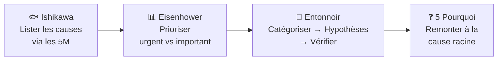
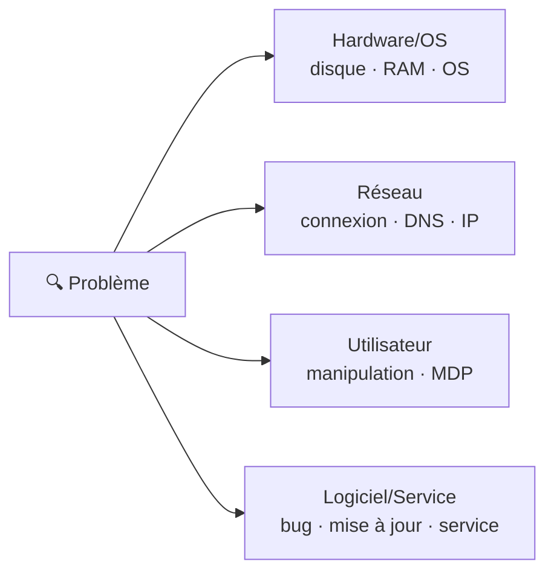

# 🔍 Module 1 — Résolution de problèmes

> **Analogie Restaurant :** Un client signale une intoxication alimentaire. Tu ne goûtes pas tous les plats au hasard. Tu explores méthodiquement : les ingrédients (Matière), la recette (Méthode), l'état du four (Matériel), la propreté (Milieu), le personnel (Main d'œuvre). Puis tu priorises : frigo en panne = urgent, formation hygiène = planifier. Enfin tu vérifies une piste à la fois en éliminant les autres.
>
> C'est la base de TOUT le cours. Chaque concept qui suit (maintenance, ITIL, sauvegardes...) repose sur cette compétence de diagnostic.

---

## Vue d'ensemble



---

## 1. Diagramme d'Ishikawa (diagramme en arêtes de poisson)

### C'est quoi ?
Un outil visuel qui organise les **causes possibles** d'un problème en catégories (5M) pour ne rien oublier.

### Les 5M

| M | Signification | Exemple IT |
|---|--------------|-----------|
| **Matière** | Ce qui sert à créer le service | Données corrompues, fichier manquant |
| **Méthode** | Façon de faire | Pas de procédure, mauvaise config |
| **Machine** | Moyens techniques | Disque dur HS, RAM saturée |
| **Milieu** | Environnement | Surchauffe, poussière, coupure électrique |
| **Main d'œuvre** | Personnel | Erreur utilisateur, manque de formation |

> Version étendue **9M** : +Management, +Maintenance, +Moyens financiers, +Mesure

### Comment l'utiliser

1. **Définir le problème** précisément (pas "ça marche pas" → "Le PC de l'accueil met 5 min à démarrer")
2. **Lister les causes** possibles dans chaque catégorie
3. **Prioriser** les causes les plus probables

### Piège
> ⚠️ Confondre cause et symptôme. "Le PC est lent" = symptôme. "Le disque est plein à 98%" = cause.

---

## 2. Matrice d'Eisenhower

### C'est quoi ?
Un outil qui classe chaque tâche/problème selon 2 axes : **urgence** × **importance** → 4 quadrants.

| | Urgent | Pas urgent |
|-|--------|-----------|
| **Important** | **Q1 — FAIRE** maintenant (serveur down) | **Q2 — PLANIFIER** (sauvegardes, formation) |
| **Pas important** | **Q3 — DÉLÉGUER** (emails admin) | **Q4 — ÉLIMINER** (réseaux sociaux) |

### Le quadrant clé : Q2
**Important + Pas urgent** = maintenance préventive, documentation, formation.

> Plus tu investis en Q2, moins tu subis de crises Q1.

### Règle pratique
Toujours **prévoir 40% de temps libre** pour les imprévus.

---

## 3. Technique de l'entonnoir

### C'est quoi ?
Méthode en 3 étapes pour passer d'un problème vague à une cause identifiée.

### Étape 1 — Catégoriser



### Étape 2 — Émettre des hypothèses
On ne cherche PAS la bonne réponse. On fait **une liste** de tout ce qui pourrait causer le symptôme.

### Étape 3 — Vérifier et éliminer

| Outil | Rôle | Quand |
|-------|------|-------|
| **Ishikawa** | Lister les causes par catégorie | Début d'analyse |
| **5 Pourquoi** | Remonter à la cause racine | Creuser |
| **Arbre de décision** | Questions fermées oui/non | Diagnostic guidé |
| **Checklist** | Points critiques | Pendant l'action |
| **Matrice de priorisation** | Ordre de traitement | Incidents multiples |
| **Journaux/logs** | Comprendre ce qui s'est passé | Post-incident |

---

## 4. Les 5 Pourquoi

Poser "pourquoi ?" en boucle jusqu'à la **cause racine** :

```
PC lent
→ Pourquoi ? Trop de programmes au démarrage
→ Pourquoi ? Installations sans contrôle
→ Pourquoi ? Pas de politique de validation
→ Pourquoi ? Pas de procédure d'installation
→ Pourquoi ? Documentation jamais rédigée
= CAUSE RACINE : absence de procédure
```

---

## Exemple complet — "Internet ne fonctionne pas"

| Étape | Action |
|-------|--------|
| 1. Catégoriser | Réseau ? Machine ? Utilisateur ? |
| 2. Hypothèses | Câble débranché · Wi-Fi off · IP incorrecte · Box HS |
| 3. Vérifier | `ipconfig` → `ping 8.8.8.8` → `nslookup google.com` |

---

## Questions de rappel actif

> **Q :** Cite les 5M d'Ishikawa avec un exemple IT chacun.
> **R :** Matière (fichier corrompu) · Méthode (pas de procédure) · Machine (disque HS) · Milieu (surchauffe) · Main d'œuvre (erreur utilisateur).

> **Q :** 3 problèmes simultanés : serveur down, collègue veut le MDP Wi-Fi, doc projet à préparer. Classe avec Eisenhower.
> **R :** Serveur = Q1 (faire). MDP Wi-Fi = Q3 (déléguer). Doc = Q2 (planifier).

> **Q :** Cite les 3 étapes de l'entonnoir.
> **R :** 1. Catégoriser · 2. Hypothèses · 3. Vérifier et éliminer.

---

## Pièges fréquents
- ⚠️ **Sauter sur la première idée** sans explorer toutes les pistes (Ishikawa)
- ⚠️ **Confondre urgence et importance** (Eisenhower)
- ⚠️ **S'arrêter au premier "pourquoi"** — la première réponse est souvent un symptôme

---

## À retenir absolument
- Ishikawa = explorer les causes (5M)
- Eisenhower = prioriser (urgent × important)
- Entonnoir = Catégoriser → Hypothèses → Vérifier
- 5 Pourquoi = creuser jusqu'à la cause racine
- Q2 (important + pas urgent) = le quadrant stratégique

## Connexions
- [[Module 2 — Maintenances]] → une fois la cause trouvée, on intervient
- [[Module 3 — ITIL]] → ITIL structure cette démarche en processus
