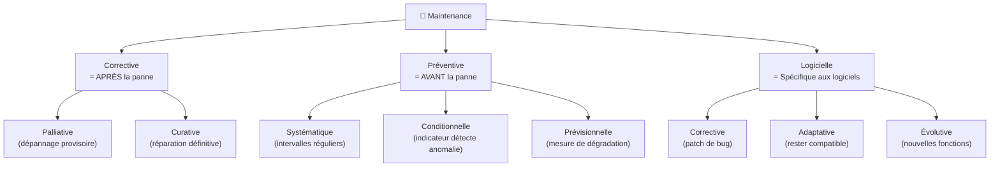
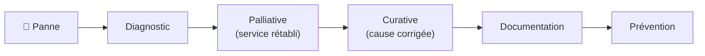

# 🔧 Module 2 — Maintenances

> **Analogie Restaurant :** La maintenance, c'est l'entretien de ta cuisine. **Corrective** = le frigo tombe en panne en plein service, tu gères l'urgence (glacière provisoire) puis tu répares. **Préventive** = chaque matin tu vérifies les frigos, les stocks, les DLC AVANT le service. **Logicielle** = tu mets à jour le firmware du four. **Évolutive** = tu ajoutes un module vapeur pour de nouvelles recettes.
>
> La maintenance, c'est le métier au quotidien d'un technicien IT.

---

## Vue d'ensemble

---

## 1. Maintenance corrective — Réparer quand c'est cassé

### Palliative (dépannage provisoire)
- Remettre le service **rapidement**, solution temporaire
- Exemples : redémarrer un service, brancher un câble de remplacement, PC de prêt
- ⚠️ La solution est **fragile** → doit être suivie d'une curative

### Curative (réparation définitive)
- Corriger **la cause** et remettre le système dans son état initial
- Exemples : remplacer un disque dur, réinstaller un OS, corriger une config

### Flux de résolution

---

## 2. Maintenance préventive — Éviter que ça casse

### Systématique
- À **intervalles réguliers**, sans vérification préalable
- Exemples : mises à jour planifiées, sauvegardes quotidiennes, nettoyage disque mensuel

### Conditionnelle
- Quand un **indicateur détecte** une anomalie (monitoring)
- Exemples : alerte disque plein à 80%, température CPU trop haute

### Prévisionnelle
- **Mesure la dégradation** progressive avant la défaillance
- Exemples : compteur SMART d'un SSD, analyse de logs de performance

### Exemples concrets

| Action préventive | Évite quoi |
|-------------------|-----------|
| Mises à jour régulières | Failles de sécurité |
| Sauvegardes planifiées | Perte de données |
| Monitoring (CPU/RAM/disque) | Panne surprise |
| Séparation admin/user | Erreurs irréversibles |
| Partitionnement disque | Perte de données à la réinstall |
| Tests en VM | Crash en production |

### Risque vs Danger
- **Danger** = ce qui PEUT causer un dommage (l'électricité)
- **Risque** = la PROBABILITÉ d'un dommage (se faire électrocuter en changeant une ampoule)
- La préventive **réduit le risque** sans éliminer le danger

---

## 3. Maintenance logicielle

| Type | Objectif | Exemple |
|------|----------|---------|
| **Corrective** | Corriger un bug | Patch qui corrige un crash |
| **Adaptative** | Rester compatible | Mise à jour driver pour Win11 |
| **Évolutive** | Ajouter des fonctions | Nouveau module dans un ERP |

---

## Les 6 actions de maintenance

| Action | Définition simple |
|--------|------------------|
| **Dépannage** | Remettre en état de fonctionner |
| **Réparation** | Faire disparaître le dysfonctionnement |
| **Réglage** | Mettre au point le fonctionnement |
| **Révision** | Examiner, mettre à jour |
| **Contrôle** | Surveiller le fonctionnement |
| **Vérification** | Tester l'exactitude |

---

## Questions de rappel actif

> **Q :** Différence entre palliative et curative ?
> **R :** Palliative = provisoire et rapide (rétablir le service). Curative = définitive (traiter la cause).

> **Q :** Cite les 3 sous-types de maintenance préventive avec un exemple chacun.
> **R :** Systématique (mises à jour planifiées) · Conditionnelle (alerte disque 80%) · Prévisionnelle (SMART du SSD).

> **Q :** Un serveur web plante, tu le redémarres. C'est quel type ?
> **R :** Palliative — le service est rétabli mais la cause n'est pas traitée.

---

## Pièges fréquents
- ⚠️ **S'arrêter à la palliative** — redémarrer tous les jours ≠ résoudre
- ⚠️ **"Tout fonctionne, pas besoin de maintenance"** — c'est quand tout va bien qu'il faut prévenir
- ⚠️ **Confondre corrective et préventive** — corrective = APRÈS · préventive = AVANT

---

## À retenir absolument
- Corrective = APRÈS (palliative + curative) · Préventive = AVANT (systématique + conditionnelle + prévisionnelle)
- Logicielle = corrective · adaptative · évolutive
- 6 actions : dépannage · réparation · réglage · révision · contrôle · vérification
- Plus on investit en prévention, moins on subit de crises

## Connexions
- [[Module 1 — Résolution de problèmes]] → le diagnostic précède la maintenance
- [[Module 3 — ITIL]] → ITIL organise les maintenances en processus
- [[Module 5 — Sauvegardes & Restauration]] → sauvegarde = maintenance préventive
