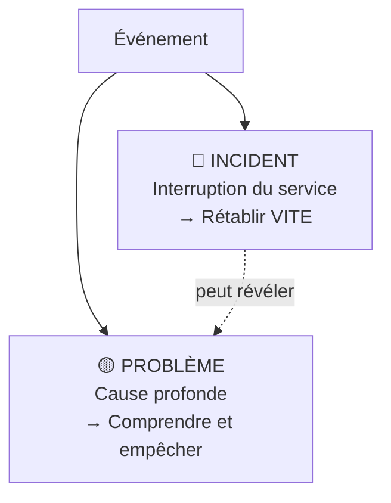
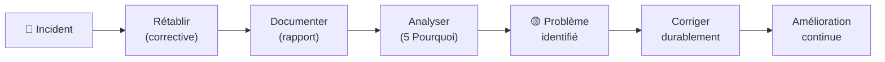

# 📋 Module 3 — ITIL

> **Analogie Restaurant :** Un client reçoit un plat froid (**incident**). Tu ne le fais pas attendre pendant que tu démontes le four — tu lui refais le plat immédiatement (rétablir le service). ENSUITE, tu vérifies le four, tu diagnostiques et tu corriges (**problème**). ITIL (Information Technology Infrastructure Library — bibliothèque de bonnes pratiques pour gérer les services IT) c'est ça : **d'abord le client, ensuite l'enquête**.

---

## La distinction fondamentale

| | Incident | Problème |
|-|----------|----------|
| **C'est quoi** | Interruption/dégradation du service | Cause profonde d'un ou plusieurs incidents |
| **Objectif** | Rétablir le service VITE | Comprendre et éliminer la cause |
| **Maintenance** | Corrective | Préventive / Évolutive |
| **Approche** | Orienté **SERVICE** | Orienté **ANALYSE** |

---

## Orienté SERVICE vs orienté SOLUTION

> Un technicien "orienté solution" **répare le problème**.
> Un professionnel "orienté service" **permet aux utilisateurs de continuer à travailler**.

ITIL dit "orienté service" parce que :
- Les systèmes sont complexes
- Réparer peut prendre longtemps
- L'activité métier **doit continuer**

→ On rétablit le service d'abord, on analyse la cause ensuite.

---

## Le cycle complet

---

## Exemples

| Situation | Type | Action |
|-----------|------|--------|
| Imprimante ne répond plus | Incident | Redémarrer le service |
| Imprimante plante 3×/semaine | Problème | Analyser : driver ? réseau ? matériel ? |
| Utilisateur n'a plus accès à ses fichiers | Incident | Vérifier permissions, rétablir |
| Permissions se réinitialisent après MAJ | Problème | Analyser la GPO, corriger |

---

## La philosophie en 3 phrases

1. **Réparer un problème, c'est bien.**
2. **Comprendre pourquoi il est arrivé, c'est mieux.**
3. **Faire en sorte qu'il n'arrive plus, c'est professionnel.**

---

## Questions de rappel actif

> **Q :** Le serveur mail plante. C'est un incident ou un problème ?
> **R :** Incident (service interrompu). On rétablit d'abord. Si ça se répète, c'est un problème (cause à analyser).

> **Q :** Pourquoi "orienté service" plutôt que "orienté solution" ?
> **R :** Parce que l'objectif est de permettre aux utilisateurs de continuer à travailler, pas juste de résoudre le problème technique.

> **Q :** Quel lien entre incident ITIL et maintenance corrective ?
> **R :** Incident → maintenance corrective. D'abord palliative (rétablir), puis curative (corriger la cause).

---

## Pièges fréquents
- ⚠️ **Confondre incident et problème** — l'incident est le symptôme, le problème est la cause
- ⚠️ **Ne traiter que les incidents** — sans analyse de problème, les mêmes incidents reviennent

---

## À retenir absolument
- **Incident** = interruption → rétablir VITE · **Problème** = cause → comprendre
- Orienté SERVICE = l'utilisateur d'abord
- Cycle : Incident → Rétablir → Documenter → Analyser → Corriger → Prévenir
- "Un bon informaticien empêche les problèmes d'arriver ET sait les gérer quand ils arrivent"

## Connexions
- [[Module 1 — Résolution de problèmes]] → les outils de diagnostic
- [[Module 2 — Maintenances]] → incident = corrective, problème = préventive
- [[Module 4 — Cyber-résilience]] → ITIL + résilience = gestion complète
