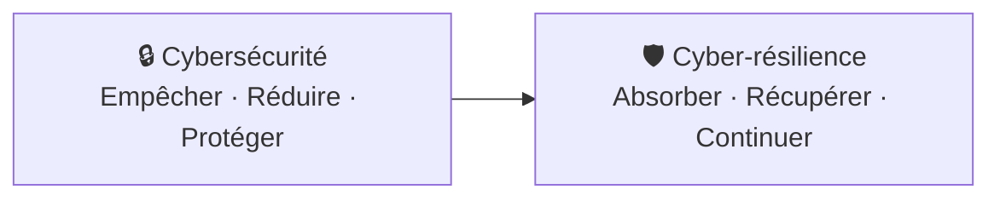
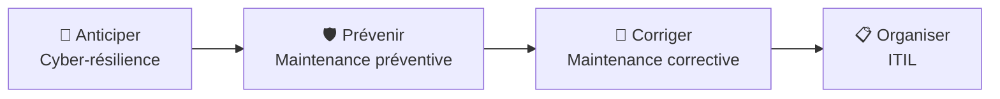

# 🛡️ Module 4 — Cyber-résilience

> **Analogie Restaurant :** La cybersécurité = fermer la porte à clé et installer une alarme (empêcher). La cyber-résilience = avoir un plan B : assurance, caméras, copie de la comptabilité chez le comptable. Si malgré tout un voleur entre, tu peux rouvrir le lendemain. L'un empêche, l'autre encaisse et rebondit.

---

## Cybersécurité vs Cyber-résilience

| | Cybersécurité | Cyber-résilience |
|-|--------------|-----------------|
| **Objectif** | Empêcher les attaques | Récupérer après un incident |
| **Question** | Comment empêcher ? | Comment rebondir ? |
| **Exemples** | Antivirus, firewall, MDP fort | Sauvegarde, plan de reprise, documentation |

> **Le risque zéro n'existe pas.** La question n'est pas "si" mais "quand". Il faut pouvoir encaisser et repartir vite.

---

## Les 4 piliers de la cyber-résilience

| Pilier | En pratique |
|--------|-----------|
| **Responsabilités claires** | Qui décide de restaurer ? Qui informe les users ? |
| **Communication maîtrisée** | "Le service est indisponible, retour estimé à 14h" |
| **Documentation utile** | Rapport d'incident, historique des actions |
| **Procédures simples** | Checklist de réaction, procédure de restauration |

---

## Catégories de risques sur un poste Windows

| Catégorie | Exemples |
|-----------|----------|
| **Humain** | MDP faible, clic phishing, suppression accidentelle |
| **Logiciel** | Malware, bug, MAJ défaillante |
| **Matériel** | Disque HS, vol de PC, panne électrique |
| **Organisation** | Pas de sauvegarde, pas de procédure, pas de formation |

---

## Cas concret — PC portable perdu dans le train

| Perdu | Exposé | Ce qui aurait limité les dégâts |
|-------|--------|-------------------------------|
| Cours, travaux, notes, temps | MDP enregistrés, données privées | Sauvegarde externe, chiffrement BitLocker |

> **THE question** : combien de temps pour se remettre à travailler ?

---

## Le fil rouge du cours

---

## Bon & mauvais usage de l'IA

### ❌ Mauvais usage
- Exécuter un script IA sans le lire → perte de données
- Modifier un script système sans comprendre → instabilité
- Copier-coller sans comprendre → impossible d'expliquer = perte de crédibilité

### ✅ Bon usage
- Faire expliquer un script ligne par ligne
- Reformuler une procédure
- Comprendre un message d'erreur
- **Apprendre**, pas décider

> **Règle d'or :** Si tu ne peux pas expliquer ce que tu proposes, tu perds en crédibilité — en cours comme en entreprise. L'IA n'annule jamais la responsabilité humaine.

---

## Cadre légal (pour info)
- **RGPD** impose des principes qui rendent la cyber-résilience indispensable
- **NIS2** exige explicitement la continuité des services face aux incidents cyber
- Ce qu'on apprend ici n'est pas "du confort", c'est ce que **la loi attend** des organisations

---

## Questions de rappel actif

> **Q :** Différence fondamentale entre cybersécurité et cyber-résilience ?
> **R :** Cybersécurité = empêcher (antivirus, firewall). Cyber-résilience = récupérer quand ça arrive malgré tout (sauvegarde, procédure, plan de reprise).

> **Q :** Un collègue te donne un script PowerShell généré par ChatGPT. Que fais-tu AVANT de l'exécuter ?
> **R :** 1. Lire et comprendre chaque ligne · 2. Vérifier la compatibilité · 3. Sauvegarder · 4. Tester en VM · 5. Seulement ensuite, exécuter.

> **Q :** PC portable perdu — cite 3 mesures de résilience qui auraient limité l'impact.
> **R :** Sauvegarde externe · Chiffrement BitLocker · Procédure de réaction (changer MDP, bloquer comptes).

---

## Pièges fréquents
- ⚠️ **"J'ai un antivirus donc je suis protégé"** — si le PC est volé ou le disque meurt, l'antivirus ne récupère rien
- ⚠️ **IA = autorité technique** — l'IA peut se tromper, les infos peuvent être obsolètes

---

## À retenir absolument
- Cyber-résilience = résister + continuer + récupérer
- 4 piliers : responsabilités · communication · documentation · procédures
- AVANT = prévention + résilience · PENDANT = corrective + ITIL
- IA = outil d'aide, jamais de décision. Responsabilité toujours humaine
- RGPD + NIS2 imposent la cyber-résilience

## Connexions
- [[Module 3 — ITIL]] → ITIL structure la gestion d'incident
- [[Module 5 — Sauvegardes & Restauration]] → sans sauvegarde, pas de résilience
