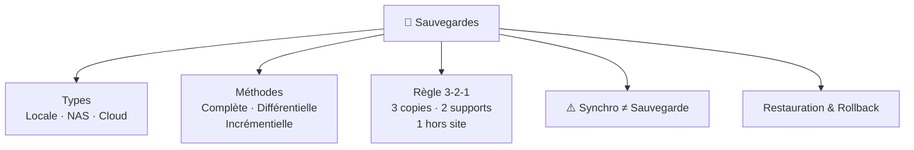

# 💾 Module 5 — Sauvegardes & Restauration

> **Analogie Restaurant :** Imagine que ta cuisine brûle. Si tu avais : une photo de chaque recette (sauvegarde), un double chez le comptable (hors site), et un classeur papier + clé USB (2 supports) — tu reconstruis. C'est la règle **3-2-1**. Et OneDrive ? C'est juste un miroir de ta cuisine : si elle brûle, le miroir brûle aussi.

---

## Vue d'ensemble

---

## 1. Types de sauvegardes par emplacement

| Type | Contrôle | Avantages | Risques |
|------|----------|-----------|---------|
| **Locale** (USB, disque externe) | Utilisateur | Rapide, simple | Perte physique, oubli |
| **Réseau — NAS** | Organisation | Centralisé, automatisable | Panne réseau, config |
| **Cloud** | Fournisseur + toi | Accessible partout | Dépendance internet |

---

## 2. Méthodes de sauvegarde Windows

### Historique des fichiers
- Simple, automatique, récupère des versions antérieures
- **Limites** : ne sauvegarde pas tout, pas une image système

### Image système
- Copie **complète** de l'ordinateur (OS + programmes + config + fichiers)
- À utiliser quand : PC ne démarre plus, virus/ransomware, système corrompu
- **Sauvegarde** protège vos fichiers · **Image système** protège votre ordinateur entier

### Logiciel tiers (Macrium, Veeam, AOMEI, Acronis)

| Type | Copie quoi | Vitesse | Restauration |
|------|-----------|---------|-------------|
| **Complète** | TOUT | Lente | Simple |
| **Différentielle** | Changé depuis dernière **complète** | Moyenne | Moyenne |
| **Incrémentielle** | Changé depuis dernière **sauvegarde** | Rapide | Complexe |

> Pourquoi pas QUE des complètes ? → Temps + Espace + Performance.

---

## 3. Règle 3-2-1

| Chiffre | Règle | Protège contre |
|---------|-------|---------------|
| **3** | 3 copies (1 originale + 2 sauvegardes) | Suppression, corruption |
| **2** | 2 supports différents | Panne matérielle |
| **1** | 1 copie hors site / déconnectée | Incendie, vol, ransomware |

> C'est une règle de **bon sens**, pas de technique.

---

## 4. ⚠️ Synchronisation ≠ Sauvegarde

| | Sauvegarde | Synchronisation |
|-|-----------|----------------|
| **Suppression** | Protège | Propage l'erreur partout |
| **Historique** | Oui (versions) | Non |
| **Ransomware** | Copie isolée intacte | Chiffrement synchronisé |

> **OneDrive = synchronisation, PAS sauvegarde.** Suppression → supprimée partout. Ransomware → chiffré partout.

---

## 5. Restauration — Les 3 niveaux

| Niveau | Quoi | Impact | Usage |
|--------|------|--------|-------|
| **Fichier** | Un seul fichier | Faible | Quotidien |
| **Dossier** | Un dossier | Moyen | Incident |
| **Système** | Image complète | Fort | Catastrophe |

> Question clé : **"À quelle date je veux revenir ?"**

---

## 6. Rollback — Revenir en arrière

| Type | Mécanisme | Exemple |
|------|-----------|---------|
| Fichier | Corbeille, historique | Fichier supprimé par erreur |
| Système | Point de restauration Windows | MAJ défaillante |
| VM | Snapshot (Hyper-V / VMware) | Annuler un test |
| Cloud | Versioning | Version précédente d'un fichier |

### Rollback vs Sauvegarde
- **Sauvegarde** = copie préventive (long terme) · **Rollback** = retour réactif (court terme)
- Un rollback dépend souvent d'une sauvegarde

### Ordre logique
1. **Rollback** (service OK) → 2. **Analyse** → 3. **Correction durable**

---

## Sauvegarde vs Archivage

| | Sauvegarde | Archivage |
|-|-----------|-----------|
| But | Récupération rapide | Stockage long terme |
| Fréquence | Régulière | Rarement modifié |

---

## Questions de rappel actif

> **Q :** Explique la règle 3-2-1 pour un étudiant.
> **R :** 3 copies (PC + disque externe + cloud). 2 supports (disque interne + disque USB). 1 hors site (cloud = hors de l'appartement).

> **Q :** OneDrive est-il une sauvegarde ?
> **R :** Non. C'est une synchronisation. Suppression ou ransomware = propagé dans le cloud.

> **Q :** Différence entre restauration et rollback ?
> **R :** Restauration = récupérer des données depuis une sauvegarde. Rollback = revenir à un état système précédent. Le rollback est plus global et immédiat.

> **Q :** Différence entre sauvegarde complète, différentielle et incrémentielle ?
> **R :** Complète = tout. Différentielle = changé depuis la dernière complète. Incrémentielle = changé depuis la dernière sauvegarde (quelle qu'elle soit).

---

## Pièges fréquents
- ⚠️ **Disque branché en permanence** — ransomware chiffre aussi les disques connectés
- ⚠️ **Ne jamais tester la restauration** — une sauvegarde jamais testée = un pari
- ⚠️ **Restaurer écrase l'existant** — toujours restaurer dans un dossier SÉPARÉ d'abord

---

## À retenir absolument
- 3-2-1 = 3 copies · 2 supports · 1 hors site
- Synchro ≠ Sauvegarde (OneDrive propage les erreurs)
- Image système = protection de l'ordinateur entier
- Restauration : fichier · dossier · système complet
- Rollback → Analyse → Correction durable
- **Sauvegarde jamais testée = pas une sauvegarde**

## Connexions
- [[Module 4 — Cyber-résilience]] → sans sauvegarde, pas de résilience
- [[Module 7 — Documentation & Procédures]] → documenter la stratégie de sauvegarde
