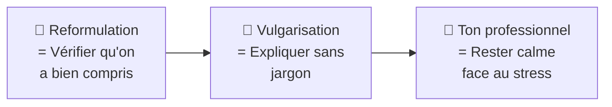

# 💬 Module 6 — Communication professionnelle

> **Analogie Restaurant :** Un client hurle "C'est dégueu !" Le serveur amateur dit "C'est la recette." Le serveur pro reformule ("Le plat ne correspond pas à vos attentes ?"), vulgarise ("la cuisson n'était pas assez poussée") et reste calme ("Je comprends, je m'en occupe immédiatement"). En IT, c'est pareil : tu parles à des humains stressés, pas à des machines.

---

## Vue d'ensemble

---

## 1. Reformulation

**Redire avec ses propres mots** ce que l'utilisateur a dit → vérifier la compréhension.

| Utilisateur dit | Technicien reformule |
|----------------|---------------------|
| "Mon PC bug, rien ne marche, j'ai tout perdu" | "Si je comprends bien, votre ordinateur ne fonctionne plus et vous avez perdu des fichiers, c'est bien ça ?" |

### Pourquoi c'est crucial
- Vérifie qu'on a bien compris
- Structure le problème
- Rassure l'utilisateur
- Évite les erreurs d'interprétation

> **Une bonne reformulation = 50% du diagnostic.**

### Erreurs fréquentes
- Ne pas reformuler → on part sur une mauvaise piste
- Couper l'utilisateur → il se sent pas écouté
- Interpréter trop vite → on saute aux conclusions

---

## 2. Vulgarisation

**Expliquer un concept technique avec des mots simples** → être compris.

| Jargon | Version vulgarisée |
|--------|-------------------|
| Le service BITS est en erreur | Un composant des mises à jour ne fonctionne plus |
| Problème de synchronisation OneDrive | Vos fichiers ne se mettent plus à jour entre PC et cloud |
| Erreur de permission NTFS | Vous n'avez pas les droits pour accéder à ce dossier |

### Erreurs fréquentes
- Utiliser du jargon avec un non-technicien
- Simplifier au point de dire quelque chose de **faux**
- Parler comme à un expert

> **Être compétent, c'est aussi savoir expliquer simplement.**

---

## 3. Ton professionnel & Gestion de crise

### Attitudes attendues : Calme · Clair · Rassurant · Respectueux

| ❌ Non professionnel | ✅ Professionnel |
|---------------------|-----------------|
| "Ce n'est pas mon problème" | "Je comprends, on va regarder ça ensemble" |
| "Vous avez dû faire une erreur" | "Je vais vérifier et revenir vers vous dans 15 min" |
| Couper la parole | Écouter jusqu'au bout |

### Pourquoi l'utilisateur réagit mal
- Il n'est **pas technique** — il ne comprend pas
- Il est **stressé** — son travail est bloqué
- Il peut **mal s'exprimer** — "rien ne marche" = parfois 1 fichier manquant

> **On ne répond pas à l'émotion, on gère la situation.**

---

## Les 4C (Softskills du cours)
- **Communication** — s'exprimer clairement
- **Collaboration** — travailler en équipe
- **Esprit critique** — analyser avant d'agir
- **Créativité** — trouver des solutions alternatives

---

## Questions de rappel actif

> **Q :** Un utilisateur dit "Mon email plante depuis ce matin, j'ai des trucs urgents !" Reformule.
> **R :** "Si je comprends bien, votre messagerie ne fonctionne plus depuis ce matin et vous avez des envois urgents en attente. Je m'en occupe en priorité."

> **Q :** Comment expliquer "erreur DNS" à un non-technicien ?
> **R :** "L'annuaire qui traduit les noms de sites en adresses ne répond plus. C'est pour ça que certains sites ne s'ouvrent pas."

> **Q :** Un utilisateur dit "Ça ne marche jamais votre truc !!" Bonne réponse ?
> **R :** "Je comprends que ce soit frustrant, on va regarder ça ensemble."

---

## Pièges fréquents
- ⚠️ **Répondre à l'émotion par l'émotion** — garder le professionnalisme
- ⚠️ **Jargon avec un utilisateur** — adapter le vocabulaire au public

---

## À retenir absolument
- Reformuler AVANT de diagnostiquer — toujours
- Vulgariser sans mentir — simplifier ≠ déformer
- Calme · Clair · Rassurant · Respectueux — même sous pression
- En entreprise : retard/absence non signalée = perte de crédibilité immédiate

## Connexions
- [[Module 7 — Documentation & Procédures]] → documenter ce qui a été communiqué
- [[Module 3 — ITIL]] → la communication fait partie de la gestion d'incident
