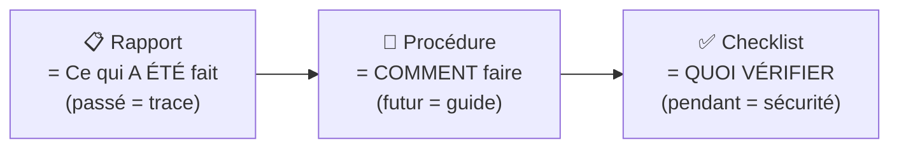

# 📝 Module 7 — Documentation & Procédures

> **Analogie Cuisine :** Le rapport d'intervention = le carnet de service du chef (ce qui s'est passé ce soir). La procédure = la recette (comment faire le plat). La checklist = la liste de vérification avant le service (frigos OK ? stocks OK ?). Les trois sont indispensables, mais chacun a un rôle différent.

---

## Vue d'ensemble

---

## 1. Rapport d'intervention

> **Un travail non documenté = un travail qui n'existe pas.**

### Structure

| Section | Contenu |
|---------|---------|
| **1. Contexte** | Qui ? Où ? Quand ? Situation initiale |
| **2. Symptômes** | Problème observé, messages d'erreur |
| **3. Actions réalisées** | Ce qui a été fait, étapes, outils |
| **4. Résultat** | Résolu ou non, état du système |
| **5. Recommandations** | Prévention, améliorations |

### Pourquoi documenter
- Traçabilité · Historique · Gestion de stock · Heures travaillées · Prochaine maintenance

### Bonnes pratiques
- **Clair · Structuré · Précis · Factuel** — pas d'opinion, des faits

---

## 2. Procédures & Logigrammes

### Procédure vs Processus

| | Processus | Procédure |
|-|-----------|-----------|
| **Niveau** | Stratégique (QUOI) | Opérationnel (COMMENT) |
| **Définition** | Activités qui transforment entrées en sorties | La façon de mettre en place le processus |

### Qualités d'une bonne procédure
**Utile · Complète · Exacte · Claire · Compatible · Accessible**

Contenu obligatoire : **QUI · QUOI · COMMENT** (éventuellement QUAND)

### Le logigramme — Procédure visuelle

| Symbole | Forme | Signification |
|---------|-------|--------------|
| ⬭ | Rectangle arrondi | Début / Fin |
| ▭ | Rectangle | Action |
| ◇ | Losange | Question / Décision |

### Procédures utilisateurs (non-techniciens)
- **1 action = 1 étape** · Phrases courtes · Verbes d'action
- **Captures d'écran** indispensables (lisibles, annotées)
- **Résultat attendu** : "À la fin, vous devez voir..."
- **Erreurs fréquentes** : "Si le bouton n'apparaît pas..."
- L'utilisateur doit pouvoir **réussir du premier coup sans aide**

### Modélisation RAD (Rôle-Activité-Diagramme)
Chaque personne ne voit que **sa colonne** (son rôle). Utile quand plusieurs personnes sont impliquées.

---

## 3. Checklists

> Ne sert pas à savoir quoi faire, mais à **ne rien oublier**.

### Checklist vs Procédure

| | Checklist | Procédure |
|-|-----------|-----------|
| Format | Liste rapide | Guide détaillé |
| Rôle | Vérification | Apprentissage |
| Quand | Pendant l'action | Avant |

### Les 3 types

**Préparation (AVANT)** : sauvegarde faite ? accès OK ? matériel prêt ?
**Exécution (PENDANT)** : étapes principales suivies ? points critiques vérifiés ?
**Validation (APRÈS)** : test OK ? service fonctionnel ? utilisateur a validé ?

### Exemple — Installation d'un outil de virtualisation

**AVANT :** ☐ Sauvegarde · ☐ Compatibilité · ☐ Source vérifiée · ☐ Droits admin · ☐ Conflit Hyper-V/VMware ?

**APRÈS :** ☐ Service fonctionne · ☐ Pas de conflit · ☐ VM démarre · ☐ Système stable

### Qualités
**Courte · Claire · Structurée · Logique** — points critiques uniquement

---

## Récapitulatif des 3 outils

| Outil | Temps | Rôle | Verbe |
|-------|-------|------|-------|
| **Rapport** | Passé | Trace | "Voilà ce qu'on a fait" |
| **Procédure** | Futur | Guide | "Voilà comment faire" |
| **Checklist** | Présent | Vérification | "N'oublie pas ça" |

---

## Questions de rappel actif

> **Q :** Cite les 5 sections d'un rapport d'intervention.
> **R :** 1. Contexte · 2. Symptômes · 3. Actions réalisées · 4. Résultat · 5. Recommandations.

> **Q :** Cite les 3 symboles d'un logigramme.
> **R :** Rectangle arrondi (début/fin) · Rectangle (action) · Losange (décision).

> **Q :** Différence entre checklist et procédure ?
> **R :** Checklist = liste rapide de vérification (pendant l'action). Procédure = guide détaillé (avant, pour comprendre).

> **Q :** Une procédure pour un utilisateur non-technicien doit contenir quoi ?
> **R :** Étapes numérotées (1 action = 1 étape), captures d'écran annotées, résultat attendu, erreurs fréquentes.

---

## Pièges fréquents
- ⚠️ **Procédure trop technique pour le public** — adapter au lecteur
- ⚠️ **Checklist trop longue** — personne ne la suit
- ⚠️ **Confondre rapport et procédure** — passé vs futur

---

## À retenir absolument
- Rapport = passé (trace) · Procédure = futur (guide) · Checklist = présent (vérification)
- Logigramme : ⬭ début/fin · ▭ action · ◇ décision
- Procédure = QUI · QUOI · COMMENT
- Procédure utilisateur = 1 action = 1 étape + captures + résultat attendu
- La checklist ne remplace pas la réflexion, elle sécurise l'action

## Connexions
- [[Module 3 — ITIL]] → ITIL exige des procédures reproductibles
- [[Module 4 — Cyber-résilience]] → documenter = pouvoir revenir en arrière
- [[Module 8 — Cloud]] → documenter la stratégie cloud
