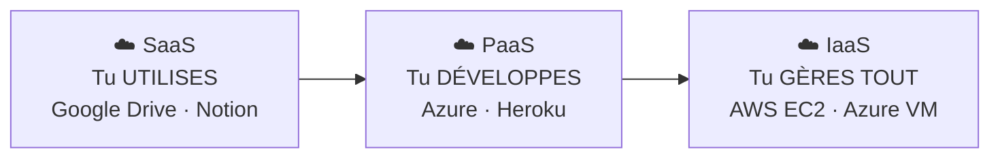

# ☁️ Module 8 — Cloud

> **Analogie Restaurant :** **SaaS** (Software as a Service) = commander au restaurant : tu manges, la cuisine ne te concerne pas. **PaaS** (Platform as a Service) = cuisiner dans une cuisine en location : tu amènes tes ingrédients, le four est fourni. **IaaS** (Infrastructure as a Service) = louer un local vide : tu amènes tout. Plus tu descends, plus tu gères.

---

## Les 3 niveaux de service cloud

| Niveau | Tu gères | Le fournisseur gère | Exemple |
|--------|----------|--------------------|----|
| **SaaS** | Rien (juste l'usage) | Tout | Google Drive, Notion, Office 365 |
| **PaaS** | Ton application | Serveur, OS, plateforme | Azure App Services, Heroku |
| **IaaS** | Serveur, OS, app, config | Juste le matériel | AWS EC2, Azure VM |

---

## Responsabilité partagée

> **Si ce n'est pas chez vous, ce n'est pas totalement à vous.**

| Aspect | Local | Cloud |
|--------|-------|-------|
| Contrôle données | Toi | Toi + fournisseur |
| Disponibilité | Toi | Fournisseur (mais dépend d'internet) |
| Sécurité | Toi | Partagée |

---

## Risques du cloud
- Perte d'accès (compte bloqué, MDP perdu)
- Dépendance internet (internet coupe = plus de travail)
- Fuite de données
- Suppression synchronisée (erreur propagée)
- Fournisseur compromis
- Changement de conditions d'utilisation
- Données stockées dans des pays avec des lois différentes

---

## Cloud et sauvegardes

> Le cloud peut faire PARTIE de la stratégie 3-2-1, mais **jamais être la seule copie**.

| Scénario | Cloud seul | Cloud + sauvegarde locale |
|----------|-----------|--------------------------|
| Suppression accidentelle | Perdu (synchro) | Récupérable |
| Ransomware | Synchronisé | Copie isolée intacte |
| Fournisseur down | Inaccessible | Copie locale disponible |

### OneDrive — LE piège

> **OneDrive = synchronisation, PAS sauvegarde.**
> Suppression → supprimée partout. Ransomware → chiffré partout.

---

## Questions de rappel actif

> **Q :** Explique SaaS, PaaS, IaaS avec un exemple chacun.
> **R :** SaaS = tu utilises (Google Drive). PaaS = tu développes sur une plateforme fournie (Azure). IaaS = tu gères un serveur virtuel complet (AWS EC2).

> **Q :** OneDrive seul est-il suffisant comme stratégie de sauvegarde ?
> **R :** Non. OneDrive synchronise (miroir). Suppression/ransomware propagés. Combiner avec sauvegarde locale (3-2-1).

> **Q :** Si internet coupe, que devient ton travail en SaaS ?
> **R :** Inaccessible. C'est la dépendance internet du cloud — il faut prévoir des copies locales.

---

## Pièges fréquents
- ⚠️ **"Cloud = protégé"** — le cloud synchronise, pas toujours sauvegarde
- ⚠️ **"Cloud = gratuit"** — les offres gratuites ont des limites
- ⚠️ **Ignorer la localisation des données** — lois différentes selon les pays

---

## À retenir absolument
- Cloud = serveurs distants, pas magique
- SaaS (utiliser) · PaaS (développer) · IaaS (tout gérer)
- Plus de contrôle = plus de responsabilité
- OneDrive = synchro ≠ sauvegarde
- Cloud = PARTIE de la stratégie 3-2-1, pas toute la stratégie

## Connexions
- [[Module 5 — Sauvegardes & Restauration]] → cloud dans la stratégie 3-2-1
- [[Module 9 — Commandes Windows]] → outils concrets de diagnostic
