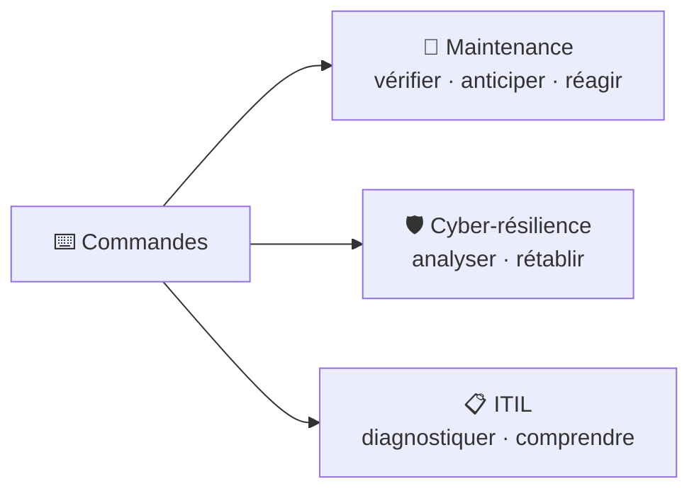

# ⌨️ Module 9 — Commandes Windows

> **Analogie Cuisine :** Les commandes Windows = tes couteaux de chef. Tu n'as pas besoin de connaître les 300 couteaux existants, mais tu maîtrises les 10 essentiels. L'interface graphique = le robot de cuisine (pratique mais limité). Le couteau = plus de précision et de contrôle.

---

## Pourquoi les commandes ?
- Parfois l'interface graphique n'est **pas disponible** (écran noir, mode sans échec)
- **Plus d'options** que le clic
- **Automatisation** via scripts
- **Rapidité et précision**

---

## Commandes par catégorie

### 🌐 Réseau

| Commande | Rôle |
|----------|------|
| `ipconfig` | Voir config IP (adresse, masque, passerelle) |
| `ipconfig /all` | Détails complets (DNS, DHCP, MAC) |
| `ping [adresse]` | Tester la connectivité |
| `tracert [adresse]` | Tracer le chemin réseau |
| `nslookup [nom]` | Tester la résolution DNS |
| `netstat` | Voir les connexions actives |

### 💻 Système

| Commande | Rôle |
|----------|------|
| `systeminfo` | Infos complètes du système |
| `sfc /scannow` | Vérifier/réparer fichiers système |
| `chkdsk` | Vérifier le disque |
| `tasklist` | Lister les processus en cours |
| `taskkill /PID [n]` | Tuer un processus |

### 📁 Fichiers & Dossiers

| Commande | Rôle |
|----------|------|
| `dir` | Lister contenu d'un dossier |
| `cd [chemin]` | Changer de répertoire |
| `copy` / `xcopy` / `robocopy` | Copier des fichiers |
| `del` | Supprimer un fichier |
| `mkdir` / `rmdir` | Créer / supprimer un dossier |

### 👤 Utilisateurs & Droits

| Commande | Rôle |
|----------|------|
| `whoami` | Voir l'utilisateur connecté |
| `net user` | Lister/gérer les comptes |
| `net localgroup` | Gérer les groupes locaux |

---

## Lien avec la matière



---

## Exemple de diagnostic — "Internet ne fonctionne pas"

```
1. ipconfig          → IP correcte ?
2. ping 8.8.8.8      → Connectivité ?
3. nslookup google.com → DNS fonctionne ?
4. tracert google.com → Où ça bloque ?
```

---

## Points d'attention

- **Respecter la syntaxe** — une espace ou un slash de trop = erreur
- **Comprendre AVANT d'exécuter** — surtout en mode administrateur
- **`del` ne demande PAS confirmation** — fichier supprimé immédiatement
- **CMD ≠ PowerShell** — syntaxe différente (ce module = CMD)
- **Ne jamais copier-coller un script sans le comprendre**

---

## Questions de rappel actif

> **Q :** Internet ne marche pas. Cite 3 commandes dans l'ordre.
> **R :** 1. `ipconfig` (vérifier IP) → 2. `ping 8.8.8.8` (connectivité) → 3. `nslookup google.com` (DNS).

> **Q :** Commande pour vérifier/réparer les fichiers système corrompus ?
> **R :** `sfc /scannow` (System File Checker).

> **Q :** Pourquoi les commandes sont parfois le seul recours ?
> **R :** Mode sans échec, écran noir, serveur sans interface graphique — CMD est le seul moyen d'interagir.

---

## Pièges fréquents
- ⚠️ **Exécuter en admin sans réfléchir** — impact système complet
- ⚠️ **`del` sans confirmation** — pas de corbeille en CMD
- ⚠️ **Confondre CMD et PowerShell** — syntaxe et capacités différentes

---

## À retenir absolument
- Les commandes ne sont PAS à mémoriser (300+) mais à COMPRENDRE et UTILISER
- Réseau : `ipconfig` · `ping` · `tracert` · `nslookup`
- Système : `systeminfo` · `sfc /scannow` · `chkdsk` · `tasklist`
- Toujours comprendre AVANT d'exécuter
- CMD = outils de maintenance + cyber-résilience + diagnostic ITIL

## Connexions
- [[Module 1 — Résolution de problèmes]] → commandes = outils de vérification (étape 3 entonnoir)
- [[Fiche Examen — Capacités terminales]] → scripting = partie de l'évaluation
