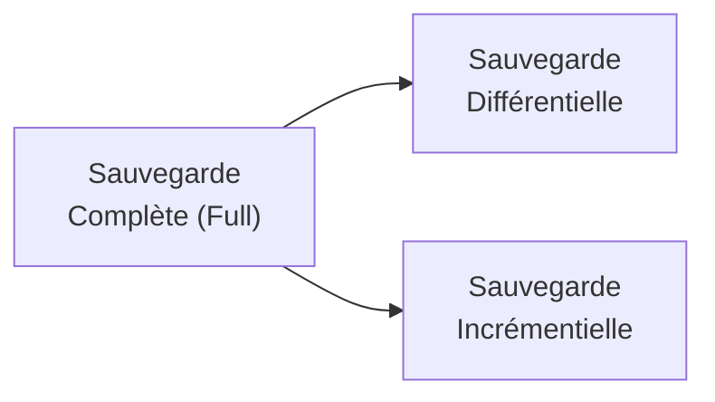

# Sauvegardes — Types & stratégies

> **Analogie Restauration :** Imagine que ta cuisine brûle. Si tu avais pris une photo de chaque recette, une copie de tes fournisseurs, et stocké le double de ta comptabilité chez ton comptable — tu peux reconstruire. Sinon, tu repars de zéro. La sauvegarde, c'est ton **assurance incendie numérique** : elle ne sert à rien jusqu'au jour où elle te sauve tout.

---

## En une phrase simple
Sauvegarder = créer une **copie de sécurité** de vos données pour pouvoir les récupérer après un problème (panne, virus, erreur humaine, vol).

## Pourquoi ça existe ?
Pour éviter : perte de données, impact sur l'utilisateur, impact sur l'organisation, et surtout — c'est une **responsabilité**.

---

## Les 3 emplacements de sauvegarde

| Type | Contrôle | Avantages | Risques |
|------|----------|-----------|---------|
| **Locale** (clé USB, disque externe) | Utilisateur | Rapide, simple | Perte physique, oubli |
| **Réseau — NAS** (Network Attached Storage) | Organisation | Centralisé, automatisable | Panne réseau, config complexe |
| **Cloud** (OneDrive, Google Drive) | Fournisseur + utilisateur | Accessible partout, versioning | Dépendance internet, confidentialité |

---

## Méthodes de sauvegarde locale automatique

### Méthode 1 — Historique des fichiers (Windows)
- Très simple, automatique
- Récupère des versions antérieures d'un fichier
- **Limites** : ne sauvegarde pas tout le disque, ne remplace pas une image système

### Méthode 2 — Image système (Windows)
- Copie **complète** de l'ordinateur à un instant T (OS + programmes + réglages + fichiers)
- Utile quand : PC ne démarre plus, virus/ransomware, système corrompu
- Plus lourd, restauration plus complexe

> **Sauvegarde** protège vos fichiers · **Image système** protège votre ordinateur entier.

### Méthode 3 — Logiciel tiers (Macrium, Veeam, AOMEI, Acronis)
- Plus de flexibilité et d'options

---

## Les 3 types de sauvegarde (logiciel tiers)

| Type | Copie quoi ? | Vitesse | Restauration | Espace |
|------|-------------|---------|-------------|--------|
| **Complète** | TOUT | Lente | Simple | Maximum |
| **Différentielle** | Ce qui a changé depuis la dernière **complète** | Moyenne | Moyenne | Moyen |
| **Incrémentielle** | Ce qui a changé depuis la dernière **sauvegarde** (quelle qu'elle soit) | Rapide | Plus complexe | Minimum |

> Pourquoi pas QUE des complètes ? → Temps + Espace + Performance.

---

## Connexions
- [[Règle 3-2-1]] — la stratégie de sauvegarde de référence
- [[Synchronisation vs Sauvegarde]] — ATTENTION : synchroniser ≠ sauvegarder
- [[Restauration & Rollback]] — sauvegarde sans restauration testée = inutile
- [[Maintenance préventive]] — sauvegardes planifiées = maintenance préventive par excellence
- [[Cyber-résilience]] — sans sauvegarde, pas de résilience

---

## Questions de rappel actif

> **Q :** Cite les 3 types de sauvegarde et explique la différence entre différentielle et incrémentielle.
> **R :** Complète (tout), Différentielle (changements depuis la dernière complète), Incrémentielle (changements depuis la dernière sauvegarde, quelle qu'elle soit). La différentielle grossit avec le temps, l'incrémentielle reste petite mais la restauration nécessite toute la chaîne.

> **Q :** Quelle est la différence entre une sauvegarde de fichiers et une image système ?
> **R :** Sauvegarde de fichiers = copie des données utilisateur. Image système = copie complète de l'ordinateur (OS + programmes + config + données). L'image permet de restaurer un PC comme s'il ne s'était rien passé.

---

## Pièges fréquents
- ⚠️ **"Le disque externe est branché en permanence"** — Si un ransomware chiffre le PC, il chiffre aussi le disque branché. Débrancher après la sauvegarde.
- ⚠️ **Ne jamais tester la restauration** — Une sauvegarde jamais testée n'est pas fiable.
- ⚠️ **Confondre NAS et sauvegarde magique** — Un NAS mal configuré = faux sentiment de sécurité.

---

## À retenir absolument
- Sauvegarder = copie de sécurité récupérable
- 3 lieux : locale · réseau (NAS) · cloud
- 3 types : complète · différentielle · incrémentielle
- Image système = protection de l'ordinateur entier
- Le disque doit être branché, le PC allumé, et **vérifier que la sauvegarde s'est bien faite**
- Peu importe la méthode : sans test de restauration, la sauvegarde est un pari

## Explorer ensuite
- [[Règle 3-2-1]] — la stratégie qui combine tous ces éléments
