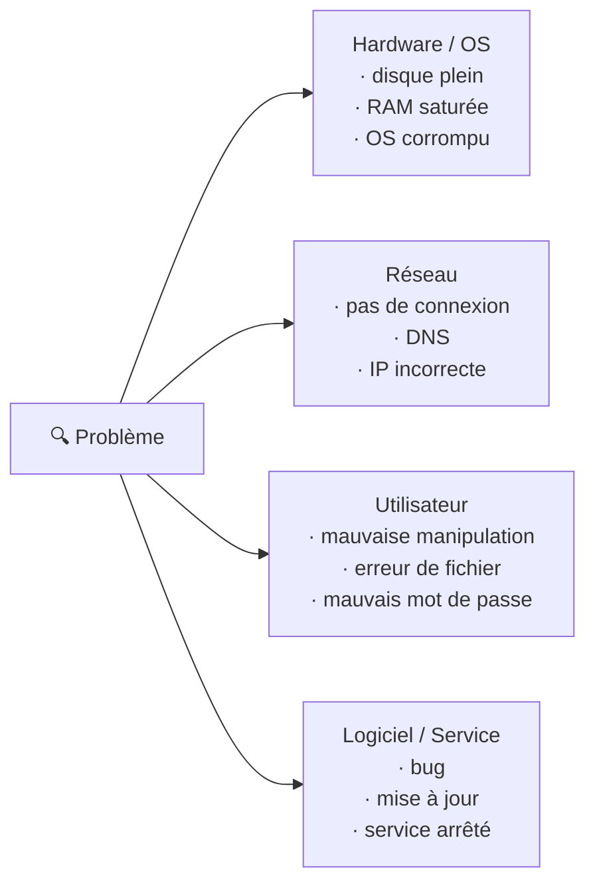

# Technique de l'entonnoir

> **Analogie Cuisine :** Quand un plat a un goût bizarre, tu ne jettes pas tout. D'abord tu goûtes chaque ingrédient séparément (catégoriser). Puis tu fais des hypothèses : "c'est peut-être le sel, ou la sauce, ou la cuisson". Ensuite tu vérifies un par un : tu goûtes la sauce seule, tu vérifies la température du four. C'est un entonnoir : du large (tout est possible) vers le précis (voilà la cause).

---

## En une phrase simple
La technique de l'entonnoir est une méthode en **3 étapes** pour passer d'un problème vague à une cause identifiée : catégoriser → hypothèses → vérification.

## Pourquoi ça existe ?
Sans méthode, le diagnostic dépend de la chance. L'entonnoir structure la réflexion pour aller du général au spécifique de manière logique et reproductible.

---

## Les 3 étapes

### Étape 1 — Catégoriser le problème

Toujours se demander : dans quelle **grande catégorie** se situe le problème ?



### Étape 2 — Émettre des hypothèses

**On ne cherche PAS la bonne réponse.** On fait une liste de tout ce qui pourrait provoquer le symptôme.

Exemple — "PC lent" :
- Trop de programmes ouverts
- Disque plein
- Virus
- Mise à jour en cours
- RAM insuffisante

### Étape 3 — Vérifier et éliminer

On utilise des **outils de diagnostic** pour tester chaque hypothèse et éliminer celles qui ne tiennent pas.

| Outil | Rôle | Quand l'utiliser |
|-------|------|-----------------|
| **Ishikawa** | Lister les causes possibles par catégorie | Début d'analyse |
| **5 Pourquoi** | Remonter à la cause racine | Creuser en profondeur |
| **Arbre de décision** | Questions fermées oui/non | Guidage pas à pas |
| **Checklist** | Vérifier les points critiques | Pendant l'action |
| **Matrice de priorisation** | Traiter les incidents par ordre | Incidents multiples |
| **Journaux/logs** | Comprendre ce qui s'est passé | Post-incident |

---

## La technique des 5 Pourquoi

Poser "pourquoi ?" en boucle jusqu'à la **cause racine** :

```
PC lent → Pourquoi ? → Trop de programmes au démarrage
→ Pourquoi ? → Installations automatiques sans contrôle
→ Pourquoi ? → Pas de politique de validation des logiciels
→ Pourquoi ? → Absence de procédure d'installation
→ Pourquoi ? → Documentation jamais rédigée
```

**Cause racine** : absence de procédure → solution durable = rédiger une procédure d'installation.

---

## Exemple complet — "Internet ne fonctionne pas"

**Étape 1** — Catégories : Réseau ? Machine ? Utilisateur ?

**Étape 2** — Hypothèses :
- Câble débranché
- Wi-Fi désactivé
- IP incorrecte
- Box HS

**Étape 3** — Vérifications :
1. Wi-Fi activé ? → `état du réseau`
2. IP correcte ? → `ipconfig`
3. Connectivité ? → `ping 8.8.8.8`
4. DNS ? → `ping google.com`

---

## Connexions
- [[Diagramme d'Ishikawa]] — Ishikawa est l'outil d'exploration de l'étape 1-2
- [[Matrice d'Eisenhower]] — si plusieurs problèmes, prioriser lequel diagnostiquer en premier
- [[Checklists]] — l'outil pro de l'étape 3 (vérification systématique)
- [[ITIL — Incidents & Problèmes]] — cette technique s'applique autant aux incidents qu'aux problèmes
- [[Commandes Windows essentielles]] — les commandes sont les outils de vérification concrets

---

## Questions de rappel actif

> **Q :** Cite les 3 étapes de la technique de l'entonnoir.
> **R :** 1. Catégoriser (Hardware/Réseau/Utilisateur/Logiciel) · 2. Émettre des hypothèses (liste de causes possibles) · 3. Vérifier et éliminer (tester chaque hypothèse).

> **Q :** Un utilisateur dit "mon email ne marche plus". Applique les 5 Pourquoi.
> **R :** Email ne marche pas → Pourquoi ? Outlook affiche une erreur de connexion → Pourquoi ? Le serveur SMTP ne répond pas → Pourquoi ? Le service est arrêté → Pourquoi ? Une mise à jour a échoué → Pourquoi ? La mise à jour n'a pas été testée en VM avant déploiement. Cause racine : absence de test avant déploiement.

---

## Pièges fréquents
- ⚠️ **Sauter directement à la solution** — "C'est sûrement un virus" sans vérifier = biais de confirmation.
- ⚠️ **S'arrêter au premier "pourquoi"** — La première réponse est souvent un symptôme, pas la cause racine.
- ⚠️ **Oublier la catégorie "Utilisateur"** — Beaucoup de problèmes viennent d'une mauvaise manipulation, pas du système.

---

## À retenir absolument
- Entonnoir = du large (catégorie) au précis (cause vérifiée)
- 3 étapes : Catégoriser → Hypothèses → Vérifier
- 5 Pourquoi = creuser jusqu'à la cause racine
- On ne cherche pas LA réponse, on élimine les hypothèses une par une

## Explorer ensuite
- [[Maintenance corrective]] — que faire une fois la cause identifiée
